Month 1 > Week 1 > Day 1

## Declarations

JavaScript has three kinds of variable declarations.

1. **var**

   Declares a variable, optionally initializing it to a value.

2. **let**

   Declares a block-scoped, local variable, optionally initializing it to a value.

3. **const**

   Declares a block-scoped, read-only named constant.

---

## A Fundamental Confusion!

### Difference between Variable and Identifier

#### Core difference _(short & precise)_

**Variable** → a **thing** that stores a value in memory

**Identifier** → the **name** you use to refer to that thing

#### Reality-first mental model

- **Variable** = box in memory

- **Identifier** = label stuck on that box

You interact with the **label**, but the **box** is what actually holds the value.

#### In code _(JavaScript example)_

<!-- 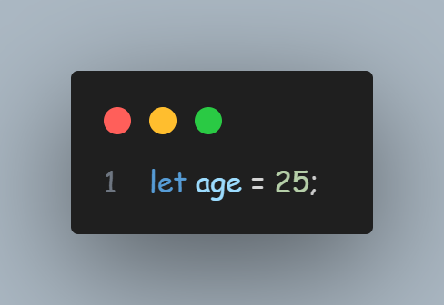 -->


Break it down:

| **Part**  | **What it is**           | **Meaning**              |
| --------- | ------------------------ | ------------------------ |
| `age`     | **Identifier**           | The name                 |
| `let age` | **Variable declaration** | Creating the box         |
| `25`      | **Value**                | What goes inside the box |

---

## Declaring Variables

You can declare a variable in two ways:

1. With the keyword `var`. For example, `var x = 42`. This syntax can be used to declare both **local** and **global** variables, depending on the execution context.

2. With the keyword `const` or `let`. For example, `let y = 13`. This syntax can be used to declare a **block-scope** local variable.

> 💡 Variables should always be declared before they are used. JavaScript used to allow assigning to undeclared variables, which creates an undeclared global variable. This is an error in strict mode and should be avoided altogether.

## Declaration & Initialization

- In a statement like `let x = 42`, the `let x` part is called a **declaration**, and the` = 42` part is called an **initializer**.

- The declaration allows the variable to be accessed later in code without throwing a `ReferenceError`, while the initializer assigns a value to the variable.

- In `var` and `let` declarations, the initializer is **optional**. If a variable is declared without an initializer, it is assigned the value **undefined**.

- Refer to the exhibit for `let` & `var`:

   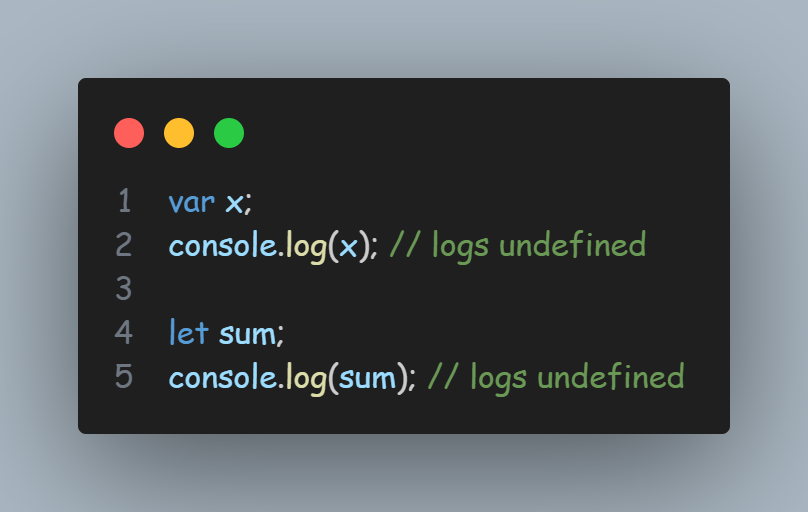

- In essence, `let x = 42` is equivalent to `let x; x = 42`.

- `const` declarations always need an initializer, because they forbid any kind of assignment after declaration, and implicitly initializing it with `undefined` is likely a programmer mistake.

- Refer to the exhibit for `const`:

   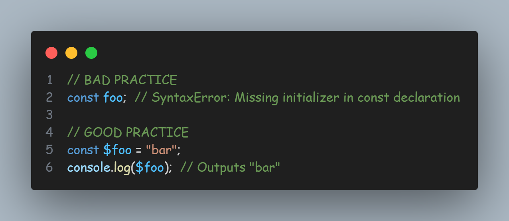

## Variable Scope

A variable may belong to one of the following scopes:

- **Global scope:** The default scope for all code running in script mode.

- **Module scope:** The scope for code running in module mode.

- **Function scope:** The scope created with a function.

In addition, variables declared with `let` or `const` can belong to an additional scope:

- **Block scope:** The scope created with a pair of curly braces _(a block)_.

> 💡 When you declare a variable outside of any function, it is called a **global variable**, because it is available to any other code in the current document.

> 💡 When you declare a variable within a function, it is called a **local variable**, because it is available only within that function.

`let` and `const` declarations can also be scoped to the block statement that they are declared in.

Refer to the exhibit below for `let` & `const` declarations:

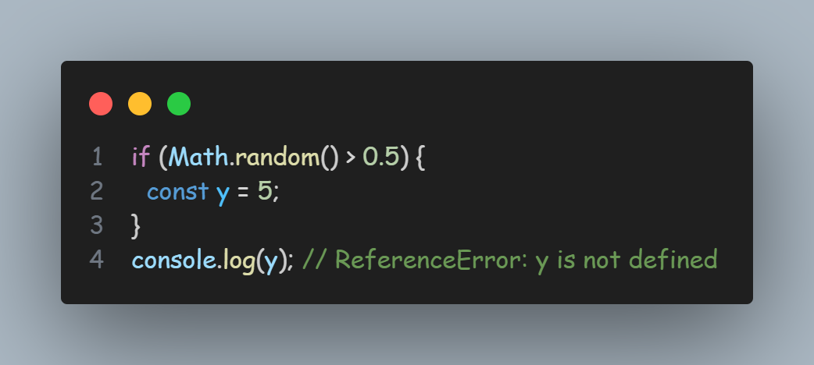

However, variables created with `var` are **not** block-scoped, but only local to the function (or global scope) that the block resides within.

Refer to the exhibit below for `var` declaration:

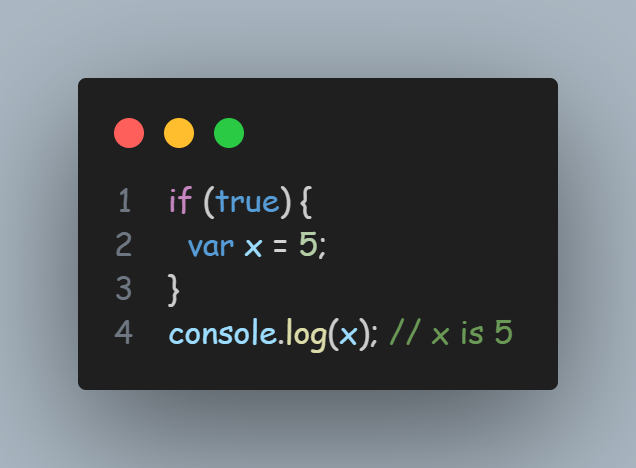

## Variable Hoisting

- `var`-declared variables are **hoisted**, meaning you can refer to the variable anywhere in its scope, even if its declaration isn't reached yet.

- You can see var declarations as being "lifted" to the top of its function or global scope.

- However, if you access a variable before it's declared, the value is always `undefined`, because only its declaration and default initialization _(with `undefined`)_ is hoisted, but not its value assignment.

- Refer to the exhibit below for hoisting `var` declaration:

   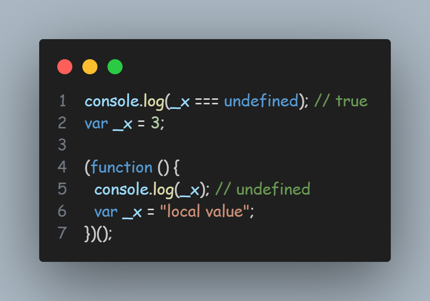

  The above examples will be interpreted the same as:

   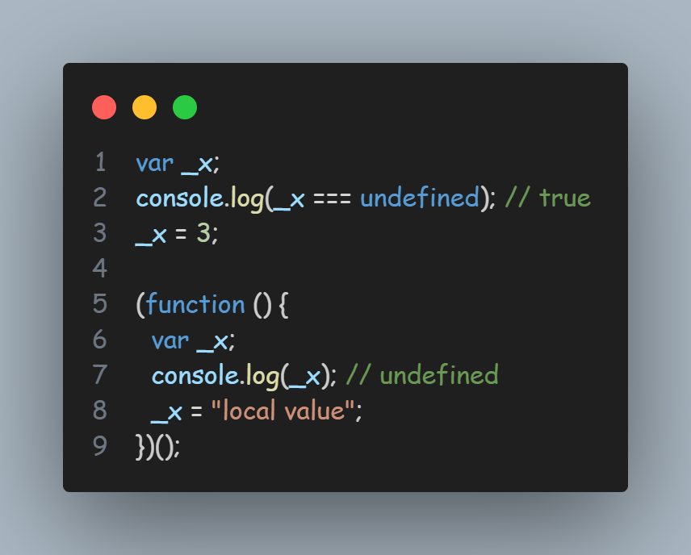

- In the case of `let` & `const`, referencing the variable in the block before the variable declaration always results in a `ReferenceError`, because the variable is in a **"temporal dead zone"** from the start of the block until the declaration is processed.

- Refer to the exhibit below for hoisting `let` & `const` declaration:

   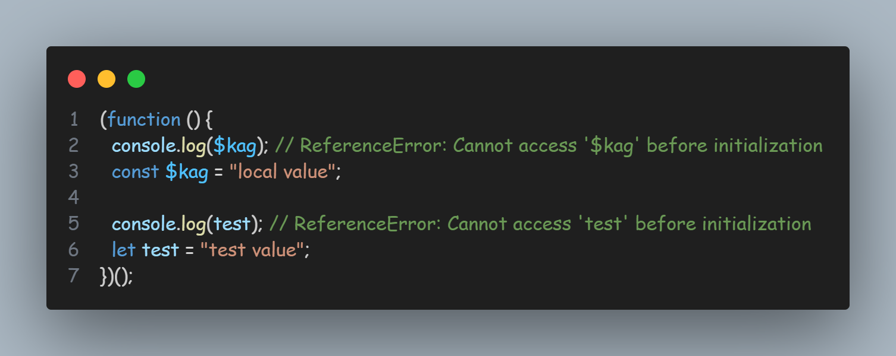

## Tagged Templates

- A more advanced form of template literals are tagged templates.

- Tags allow you to parse template literals with a function. The first argument of a tag function contains an array of string values. The remaining arguments are related to the expressions.

- The tag function can then perform whatever operations on these arguments you wish, and return the manipulated string. _(Alternatively, it can return something completely different, as described in one of the following examples in the exhibit.)_

   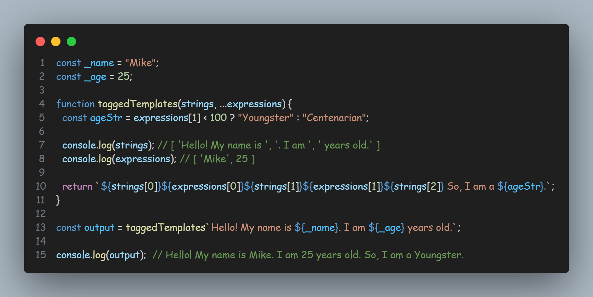

> 💡 A tagged template is just a function call — written in a special syntax.

---

Month 1 > Week 1 > Day 2

## Functions

- A function is a "subprogram" that can be called by code external (or internal, in the case of recursion) to the function.

- Like the program itself, a function is composed of a sequence of statements called the function body.

- Values can be passed to a function as parameters, and the function will return a value.

- Function values are typically instances of `Function`. Callable values cause `typeof` to return "function" instead of "object".

  or

- Functions in JavaScript are objects created from the Function constructor, but JavaScript treats **callable objects specially** and reports their type as "function" instead of "object".

   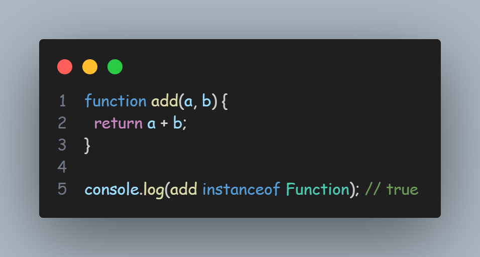

- So:
  - `add` is a **function**
  - internally, it's an **object**
  - Its constructor is `Function`

### Proof that functions ARE objects

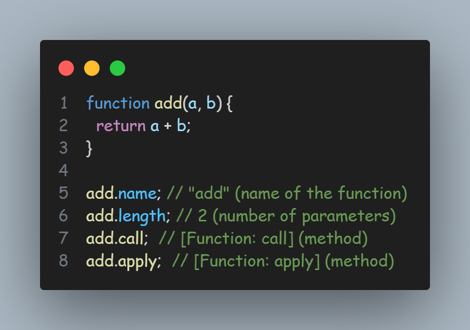

You can:

- attach properties
- pass functions as values
- return them
- store them in arrays

> 💡 Function = Object + ()

### Return Value

- By default, if a function's execution doesn't end at a `return` statement, or if the `return` keyword doesn't have an expression after it, then the return value is `undefined`.

- The `return` statement allows you to return an arbitrary value from the function.

- One function call can only return one value, but you can simulate the effect of returning multiple values by returning an object or array and destructuring the result.

   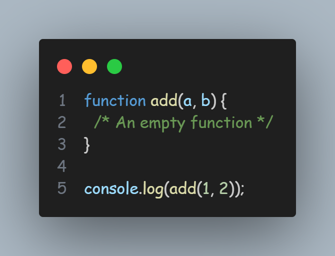

### The `this` Keyword

The `this` keyword refers to the object that the function is accessed on — it does not refer to the currently executing function, so you must refer to the function value by name, even within the function body.

> 💡 `this` means the object on which the function was called

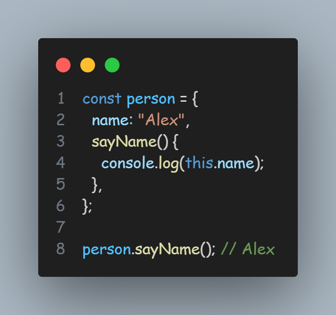

### Now the scary part (same function, different this)

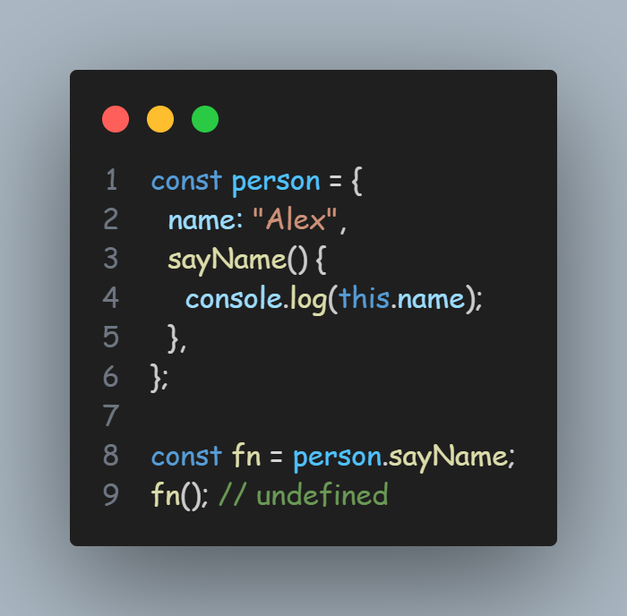

What is `this` now?

- ❌ not person
- ❌ not the function
- ✅ `undefined` (in strict mode)

Because:

```
fn(); // no object on the left
```

> 💡 `this` is not lexical. It is dynamic. It is determined **at call time**, not at write time.

### Defining functions

- There are special syntaxes for defining **arrow functions** and **methods**, which provide more precise semantics for their usage.

- Classes are conceptually not functions _(because they throw an error when called without `new`)_, but they also inherit from `Function.prototype` and have `typeof` `MyClass === "function"`.

<!-- Paste screenshot of `Defining Functions` code snippet from playground.js -->

All syntaxes do approximately the same thing, but there are some subtle behavior differences.

- The `Function()` constructor, `function` expression, and `function` declaration syntaxes create full-fledged function objects, which can be constructed with `new`. However, arrow functions and methods cannot be constructed. Async functions are not constructible regardless of syntax.

- The `function` declaration creates functions that are **hoisted**. **Other syntaxes** do not hoist the function and the function value is only visible **after the definition**.

- The arrow function and `Function()` constructor always create anonymous functions, which means they can't easily call themselves recursively. One way to call an arrow function recursively is by assigning it to a variable.

- The arrow function syntax does not have access to `arguments` or `this`.

- The `Function()` constructor cannot access any local variables — it only has access to the global scope.

- The `Function()` constructor causes runtime compilation and is often slower than other syntaxes.

> 💡 Arrow functions capture this from the surrounding scope at the time they are created. This is called lexical `this`.

- Refer to the exhibit below for lexical `this` (arrow fn):

<!-- Paste screenshot of Lexical this (arrow fn) code snippet from playground.js -->

Why?

- `normal()` → `this = obj`
- `arrow()` → `this` comes from outer scope, not obj

### Function Scope & Closures

- Functions form a scope for variables—this means variables defined inside a function cannot be accessed from anywhere outside the function.

- The function scope inherits from all the upper scopes. For example, a function defined in the global scope can access all variables defined in the global scope.

- A function defined inside another function can also access all variables defined in its parent function, and any other variables to which the parent function has access. On the other hand, the parent function (and any other parent scope) does not have access to the variables and functions defined inside the inner function. This provides a sort of encapsulation for the variables in the inner function.

### Closures

- A parent scope that defines some variables or functions. It should have a clear lifetime, which means it should finish execution at some point. **Any scope that's not the global scope satisfies this requirement; this includes blocks, functions, modules, and more**.

- An inner scope defined within the parent scope, which refers to some variables or functions defined in the parent scope.

---

Month 1 > Week 1 > Day 3

## Indexed Collections _(Array)_

- An array is an ordered list of values that you refer to with a name and an index.

  - For example, consider an array called `emp`, which contains employees' names indexed by their numerical employee number. So `emp[0]` would be employee number zero, `emp[1]` employee number one, and so on.

- JavaScript does not have an explicit array data type. However, you can use the predefined `Array` object and its methods to work with arrays in your applications. The `Array` object has methods for manipulating arrays in various ways, such as joining, reversing, and sorting them. It has a property for determining the array length and other properties for use with regular expressions.

- Refer to the exhibit below that demonstrate some statements that create equivalent arrays:

<!-- Paste screenshot of `Creating Array (different ways)` code snippet from playground.js -->

- If you wish to initialize an array with a single element, and the element happens to be a Number, you must use the bracket syntax. When a single Number value is passed to the `Array()` constructor or function, it is interpreted as an `arrayLength`, not as a single element.

- Refer to the exhibit below showing array initialization:

<!-- Paste screenshot of `Array Initialization` code snippet from playground.js -->

> 💡 You can also use the `Array.of` static method to create arrays with single element.

### Referring to Array Elements

You can use **property accessors** to access other properties of the array, like with an object. Refer

<!-- Paste screenshot of `Property accessors` code snippet from playground.js -->

### Populating an Array

If you supply a non-integer value to the array operator _(like in the code in exhibit below)_, a property will be created in the object representing the array, instead of an array element.

<!-- Paste screenshot of `Populating array` code snippet from playground.js -->

### Iterating over arrays

- A common operation is to iterate over the values of an array, processing each one in some way, as follows:
<!-- Paste screenshot of `Iterating over arrays > method 1` code snippet from playground.js -->

- If you know that none of the elements in your array evaluate to `false` in a boolean context—if your array consists only of **DOM** nodes, for example—you can use a more efficient idiom:
<!-- Paste screenshot of `Iterating over arrays > method 2` code snippet from playground.js -->

- This avoids the overhead of checking the length of the array, and ensures that the `div` variable is reassigned to the current item each time around the loop for added convenience.

- The `forEach()` method provides another way of iterating over an array:
<!-- Paste screenshot of `Iterating over arrays > method 3` code snippet from playground.js -->

- The function passed to `forEach` is executed once for every item in the array, with the array item passed as the argument to the function. **Unassigned values** are not iterated in a `forEach` loop.

- Note that the elements of an array that are omitted when the array is defined are not listed when iterating by `forEach`, but are listed when `undefined` has been manually assigned to the element (refer to the following exhibit):
<!-- Paste screenshot of `Iterating over arrays > method 4` code snippet from playground.js -->
