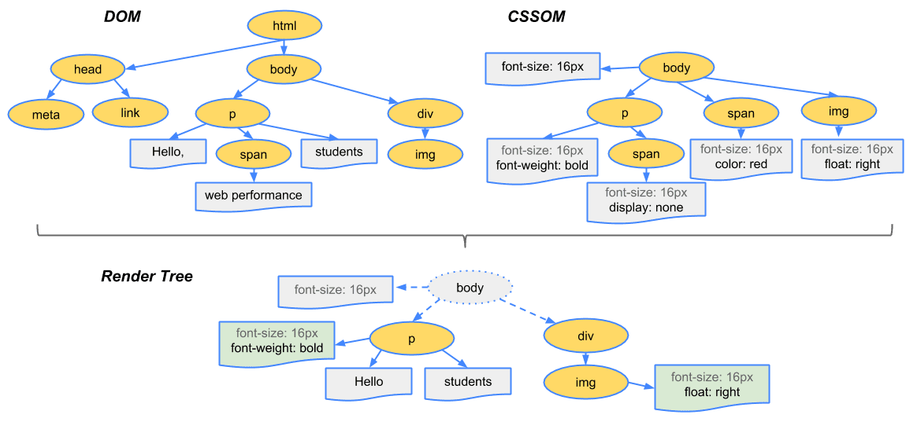
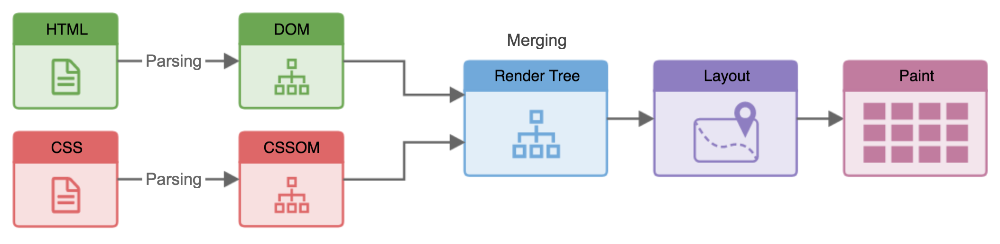
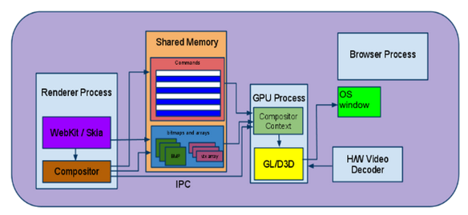

# Week 7 - Intro to Performance

## Day 1 – Mental Model of Browser Performance





### 1️⃣ The Browser Is an Assembly Line _(Not Magic)_

Think of the browser like a factory with **strict stages**. <br>
You _cannot_ skip stages. If you disturb one, everything downstream pays the price.

#### The Real Pipeline

```scss
HTML  ──▶ DOM
CSS   ──▶ CSSOM
DOM + CSSOM ──▶ Render Tree
Render Tree ──▶ Layout (Reflow)
Layout ──▶ Paint
Paint ──▶ Composite (GPU)
```

Key truth:

> Most performance bugs happen because devs accidentally restart this pipeline.

### 2️⃣ DOM ≠ What You See

#### DOM

- Structure only
- Nodes, hierarchy
- No sizes, no pixels

#### CSSOM

- Style rules
- Cascade resolved
- Still no pixels

#### Render Tree

- Only visible elements
- `display: none` ❌ removed
- Ready for layout

👉 Performance insight: <br>
Changing DOM structure is cheaper than triggering layout.

### 3️⃣ Layout _(Reflow)_: The Expensive Villain

#### What Layout Does

**Calculates**:

- width / height
- position
- geometry

**Depends on**:

- viewport
- parent elements
- siblings

#### Why It’s Expensive

- One change can affect **hundreds of nodes**
- Often **recursive**
- Happens on the **main thread**

#### Triggers

- Changing:
  - `width`, `height`
  - `margin`, `padding`
  - `top/left`
  - `display`
  - `font-size`

- Reading layout data:
  - `offsetHeight`
  - `getBoundingClientRect()`

> Reflow is like changing the foundation of a building after construction.

### 4️⃣ Paint: Death by a Thousand Cuts

#### What Paint Does

- Colors pixels
- Borders, shadows, text
- Happens after layout

#### Paint Is:

- Cheaper than layout
- Still expensive if frequent

#### Triggers

- `color`
- `background`
- `box-shadow`
- `border-radius`

> One paint is fine. <br>
> **Hundreds per second = jank**.

### 5️⃣ Composite: The Performance Cheat Code



#### What Composite Does

- Moves already-painted layers
- Uses GPU
- No layout
- No paint

#### Properties That Only Composite

✅ `transform` <br>
✅ `opacity`

This is why animations **must** use transform/opacity.

### 6️⃣ The One Rule That Explains 80% of Performance

**DOM Read → DOM Write → DOM Read = Performance Bug**

Example of trouble:

```js
box.style.width = "200px"; // write
console.log(box.offsetWidth); // read (forces layout)
box.style.height = "200px"; // write (forces layout again)
```

This forces the browser to:

- Flush pending changes
- Recalculate layout **multiple times**

This is called **layout thrashing**.

### 7️⃣ Performance Is About Cascades, Not Lines

Important mindset shift:

- Performance cost is **non-local**
- One innocent line can trigger:
  - layout → paint → composite
  - across the whole page

So stop asking:

> “Is this line expensive?”

Start asking:

> “What stage of the pipeline does this line touch?”

### 8️⃣ Your Day 1 Task _(Mandatory)_

#### ✅ Task A: Observe

1. Open **any website**
2. Open **DevTools → Performance**
3. Click **Record**
4. Reload the page
5. Stop recording

Look For

- Purple bars → layout
- Green bars → paint
- Long yellow blocks → JS

Don’t optimize. <br>
**Just observe**.

#### ✅ Task B: Answer These _(Write Them Down)_

1. What triggers layout?
2. What is cheaper: paint or layout?
3. Why are `transform` animations smooth?
4. Why is reading `offsetHeight` dangerous?

If you can answer these **without Googling**, Day 1 is complete.

### What You Gained Today

- A **mental x-ray** of the browser
- Ability to _predict_ performance issues
  Foundation for every optimization you’ll do next

## Day 2 – Reflows & Repaints _(Hands-on Pain)_

### 0️⃣ Setup _(2 minutes)_

Open **any of your Bootcamp apps** _(even a simple page with a box + button)_.

Open:
- Chrome DevTools
- Performance tab
- Enable:
    - ☑ Screenshots
    - ☑ Advanced paint instrumentation

### 1️⃣ Pain #1 – Layout Thrashing _(The Classic Mistake)_

#### ❌ Intentionally Bad Code

```js
const box = document.querySelector('.box');

for (let i = 0; i < 1000; i++) {
  box.style.width = box.offsetWidth + 1 + 'px';
}
```

#### What You Just Did

- `offsetWidth` → **forces layout**
- `style.width` → **invalidates layout**
- Loop = **1000 forced reflows**

#### Observe

- Click Record
- Trigger this code
- Stop recording

Look for:

- Purple bars exploding
- Long “Layout” events
- Main thread blocked

#### 🧠 Insight

> The browser had no choice but to recalculate layout every iteration.

### 2️⃣ Fix #1 – Batch Reads & Writes _(Respect the Pipeline)_

#### ✅ Fixed Code

```js
const box = document.querySelector('.box');

let width = box.offsetWidth; // one read

for (let i = 0; i < 1000; i++) {
  width += 1;
}

box.style.width = width + 'px'; // one write
```

#### Observe Again

- Almost no layout
- Main thread breathes
- FPS stays stable

#### 🔥 Rule Burned Into Brain

> Read first. Write later. Never alternate.

### 3️⃣ Pain #2 – Death by Repaint

#### ❌ Bad Paint Loop

```js
const box = document.querySelector('.box');

setInterval(() => {
  box.style.backgroundColor =
    box.style.backgroundColor === 'red' ? 'blue' : 'red';
}, 16);
```

This repaints **~60 times/sec**.

#### Observe

- Paint events firing constantly
- CPU usage rising
- Battery crying silently

### 4️⃣ Paint Flashing _(Visual Truth Serum)_

#### Enable Paint Flashing

DevTools → More tools → Rendering →
☑ Paint flashing

Now trigger the repaint again.

💥 You’ll literally see the browser flashing green.

#### 🧠 Insight

> Paint cost is invisible… until you make it visible.

### 5️⃣ Fix #2 – Composite Instead of Paint

#### ❌ Paint-triggering property

- `background-color`

#### ✅ Composite-only properties

- `transform`
- `opacity`

#### Fixed Example

```
box.style.transition = 'transform 0.3s';

box.addEventListener('click', () => {
  box.style.transform = 'scale(1.1)';
});
```

Observe:

- No paint flashing
- GPU doing the work
- Smooth animation

🔥 This is why transform/opacity are sacred.

### 6️⃣ Pain #3 – display vs visibility vs opacity

### Try This

```js
box.style.display = 'none';
box.style.display = 'block';
```

vs

```js
box.style.visibility = 'hidden';
box.style.visibility = 'visible';
```

vs

```js
box.style.opacity = '0';
box.style.opacity = '1';
```

#### Observe Cost

| Property    | Layout | Paint | Composite  |
|-------------|--------|-------|------------|
| display     | ✅      | ✅     | ❌          |
| visibility  | ❌      | ✅     | ❌          |
| opacity     | ❌      | ❌     | ✅          |

#### 🧠 Engineer Insight

> `display` is a sledgehammer. `opacity` is a scalpel.

### 7️⃣ The “Why” That Changes Everything

#### The Browser Promise

- Browser tries to **delay layout**
    - Read layout
    - Force sync measurements
    - Toggle structural properties

When you read layout:

> “Hey browser, I need accurate numbers right now.”

So the browser flushes everything.

### 8️⃣ Your Day 2 Mandatory Tasks

#### ✅ Task A – Create Layout Hell

- Write a loop that alternates:
    - style write
    - layout read
    - Profile it

#### ✅ Task B – Fix It
- Batch reads
- Batch writes
- Re-profile

#### ✅ Task C – Explain _(Out Loud or Written)_

Answer:
1. Why does `offsetHeight` trigger layout?
2. Why is `opacity` cheap?
3. Why is layout worse than paint?
4. Why does batching work?

If you can explain it without code, you own it.

### What You Gained Today
- You felt layout cost
- You saw paint cost
- You learned to negotiate with the browser

## Day 3 – Blocking JavaScript _(Main Thread Jail)_

This day is about one brutal truth:

> If JavaScript is busy, the browser is frozen.

No clicks. <br>
No scroll. <br>
No paint. <br>
No mercy.

### 1️⃣ What the Main Thread Actually Does

The **main thread** is responsible for:
- Running JavaScript
- Handling user input
- Calculating layout
- Painting pixels

⚠️ It can only do one thing at a time.

So when JS runs:
- Rendering pauses
- Input waits
- Animations stutter

This is why performance isn’t about speed, it’s about **blocking time**.

### 2️⃣ Pain #1 – The Innocent Loop That Kills UX

#### ❌ Create a Main Thread Freeze

```js
function blockMainThread() {
  const start = performance.now();
  while (performance.now() - start < 3000) {
    // simulate heavy computation for 3s
  }
}

document.querySelector('button').addEventListener('click', blockMainThread);
```

#### What to Do

- Open DevTools → **Performance**
- Click Record
- Click the button
- Try scrolling or clicking elsewhere

#### What You’ll See

- Page completely frozen
- Huge yellow Long Task
- Input ignored

#### 🧠 Insight

> The browser didn’t “lag” — it was **obediently executing your code**.

### 3️⃣ Long Tasks: The Silent Killer

A **Long Task** = JS running > **50ms**

Why 50ms?
- 60fps needs a frame every ~16ms
- Anything longer drops frames
- UX feels sluggish immediately

#### In DevTools

- Yellow blocks = JS
- Big yellow slabs = long tasks
- Red triangle warnings = bad news

### 4️⃣ Pain #2 – Blocking on Page Load

#### ❌ Synchronous Load Trap

```html
<script src="heavy.js"></script>
```

Inside `heavy.js`:

```js
for (let i = 0; i < 1e8; i++) {}
```

#### Observe

- Page doesn’t render
- Blank screen
- Browser waits for JS

#### 🧠 Reality Check

> HTML parsing pauses until the script finishes.

### 5️⃣ Fix #1 – Defer Is Not Optional

#### ✅ Correct Load Strategy

```html
<script src="heavy.js" defer></script>
```

What `defer` does:
- HTML parses fully
- DOM builds
- Script runs after
- No render blocking

#### 🔥 Rule

> Default to `defer`. Opt out only when necessary.

### 6️⃣ Pain #3 – Heavy Click Handlers

#### ❌ UI Hostage Situation

```js
button.addEventListener('click', () => {
  for (let i = 0; i < 5e7; i++) {}
  alert('Done');
});
```

User clicks → app freezes → user panics.

### 7️⃣ Fix #2 – Time Slicing _(Let the Browser Breathe)_

#### ✅ Chunk the Work

```js
function doWork(deadline) {
  while (deadline.timeRemaining() > 0 && tasks.length) {
    tasks.pop()();
  }

  if (tasks.length) {
    requestIdleCallback(doWork);
  }
}

requestIdleCallback(doWork);
```

Alternative (simpler):

```js
function heavyTaskChunked(i = 0) {
  if (i >= 1e7) return;
  for (let j = 0; j < 1000; j++) {}
  setTimeout(() => heavyTaskChunked(i + 1000));
}
```

#### 🧠 Insight

> You’re not making JS faster — you’re making it **polite**.

### 8️⃣ Pain #4 – JSON Parsing Is Not Free


❌ Hidden Cost

```js
const data = JSON.parse(hugeJSONString);
```

- Parsing happens on main thread
- Large payload = noticeable freeze

#### Fix Strategies

- Smaller payloads
- Lazy parsing
- Web Workers _(later week)_

### 9️⃣ The Performance Mindset Shift

Stop asking:
> “How fast does this function run?”

Start asking:
>“How long does this block the main thread?”

That’s the only question users feel.

### 🔟 Day 3 Mandatory Tasks

#### ✅ Task A – Create a Long Task

- Freeze the UI for 2–3 seconds
- Record it in DevTools

#### ✅ Task B – Fix It

- Use `defer`
- Chunk the work
- Re-profile

#### ✅ Task C – Answer These

- Why does JS block rendering?
- Why is 50ms a magic number?
- Why does `defer` matter?
- Why is “valid JS” still bad UX?

If you can explain these without buzzwords—you’re thinking like an engineer.

### What You Gained Today
- You understand why apps freeze
- You learned to respect the main thread
- You stopped blaming the browser