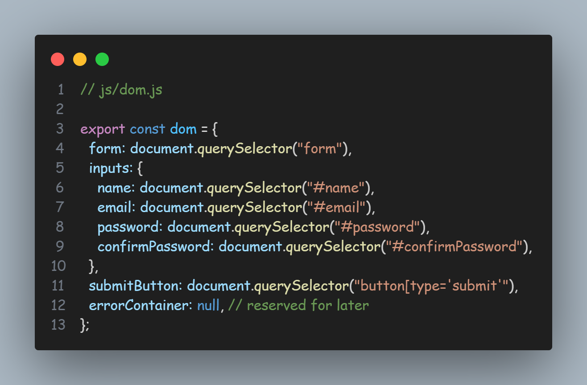
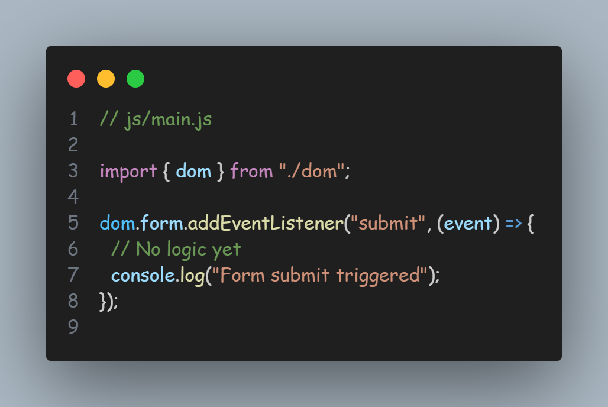
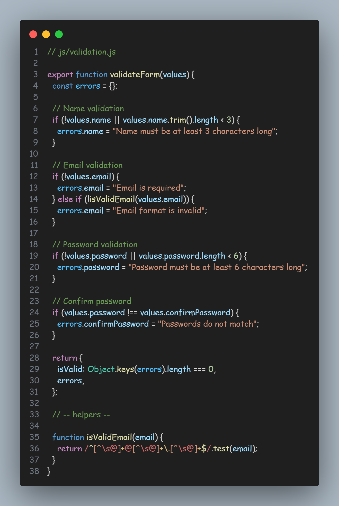
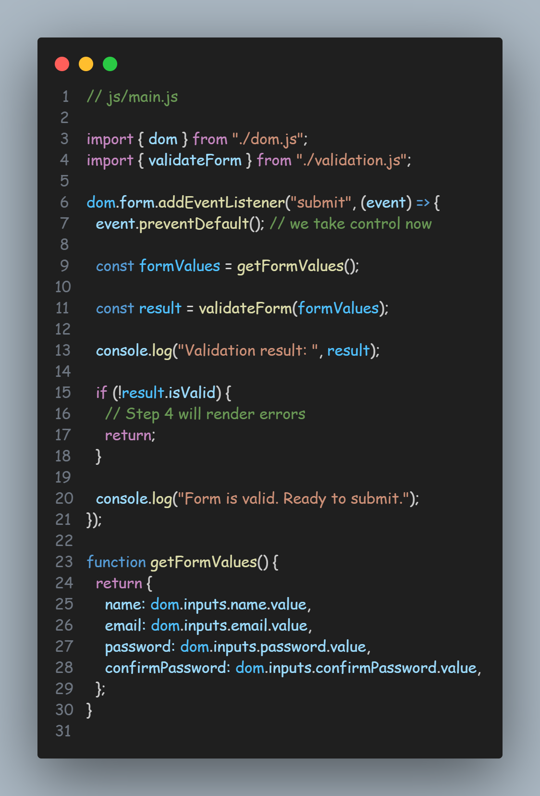
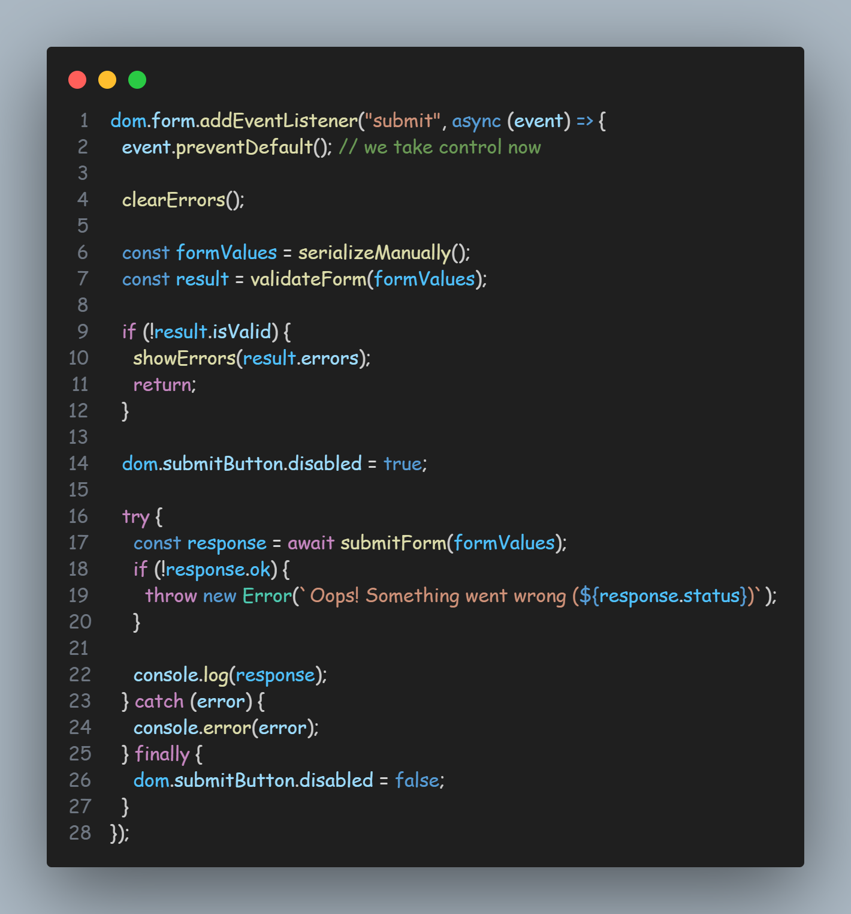
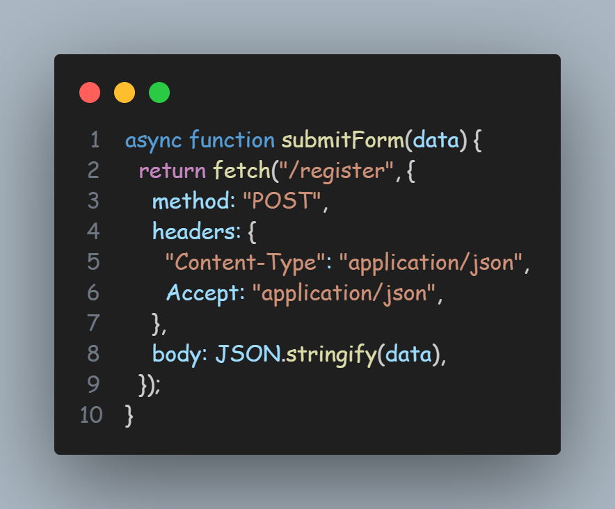

# Vanilla JS Form System

## Step 1: Base HTML Form _(Browser-Native)_

### Objectives

- Works **without JavaScript**
- Uses **browser validation**
- Produces a **real HTTP request**
- Can be debugged in **Network tab**

If this step is solid, everything else becomes _enhancement_, not repair.

### 1️⃣ Choose a Simple, Realistic Use-Case

We’ll use a **User Registration Form**

_(Enough complexity to learn, not enough to distract)_

**Fields**

- Full Name
- Email
- Password
- Confirm Password
- Submit

### 2️⃣ The HTML _(Read Carefully)_

```html
<!DOCTYPE html>
<html lang="en">
  <head>
    <meta charset="UTF-8" />
    <title>Vanilla JS Form System</title>
  </head>
  <body>
    <h1>User Registration</h1>

    <form method="POST" action="/register">
      <div>
        <label for="name">Full Name</label>
        <input id="name" name="name" type="text" required minlength="3" />
      </div>

      <div>
        <label for="email">Email</label>
        <input id="email" name="email" type="email" required />
      </div>

      <div>
        <label for="password">Password</label>
        <input
          id="password"
          name="password"
          type="password"
          required
          minlength="6"
        />
      </div>

      <div>
        <label for="confirmPassword">Confirm Password</label>
        <input
          id="confirmPassword"
          name="confirmPassword"
          type="password"
          required
        />
      </div>

      <button type="submit">Register</button>
    </form>
  </body>
</html>
```

### 3️⃣ Why Every Line Matters _(No Fluff)_

✅ `method="POST"`

- Sends data in request body
- Correct semantic choice for registration

✅ `action="/register"`

- Browser will navigate here
- Network request will be visible
- Can be mocked later

✅ `name` attributes

> Without name, data is never sent

This is the #1 silent bug in forms.

✅ Native Validation Attributes

- `required`
- `type="email"`
- `minlength`

These:

- Run **before HTTP**
- Block submission automatically
- Require **zero JS**

✅ `<label for="">`

- Accessibility
- Click-to-focus
- Screen reader support
- Keyboard navigation

This is **not optional** in serious systems.

Open this file in a browser and try:

### Case 1: Click submit with empty fields

- Browser blocks submission
- Native error message appears
- ❌ No network request

### Case 2: Invalid email

- Browser shows format error
- ❌ Still no request

### Case 3: All valid values

- Browser sends POST request
- Page navigates
- Network tab shows request

This confirms:

> **Validation happens before HTTP**

### 5️⃣ Network Tab Check _(Do This)_

Open DevTools → Network:

- Filter: **Doc**
- Submit form
- Click request
- Inspect:
  - Method
  - Headers
  - Payload `(application/x-www-form-urlencoded)`

You are now seeing **real browser behavior**, not theory.

### 6️⃣ Core Truths Locked in by Step 1

- Forms are browser-native
- Validation blocks requests
- `name` controls serialization
- No JS is required for real submissions
- Browser already solves many problems

Everything else we add later is **progressive enhancement**.

## Step 2: Controlled DOM Access Layer

### Objectives

Create a **single, disciplined entry point** for:

- Reading DOM
- Writing DOM
- Avoiding repeated queries
- Preventing mutation chaos

This is **architecture**, not syntax.

### 1️⃣ The Problem We’re Solving

Typical beginner code looks like this:

```js
document.querySelector("#email").value;
document.querySelector("#email").classList.add("error");
document.querySelector("#email").focus();
```

Problems:

- Repeated DOM queries
- Hard to change selectors
- Performance cost
- Impossible to reason about mutations

We fix this **now**, before logic grows.

### 2️⃣ Create a DOM Access Module

Create a new file:

📁 `js/dom.js`



Why this matters:

- One source of truth
- Read-only references
- No accidental re-querying

### 3️⃣ Rules of This Layer _(Non-Negotiable)_

These rules apply **throughout the project**:

- ❌ No `document.querySelector` outside this file
- ❌ No inline DOM queries in logic files
- ✅ DOM nodes are **cached once**
- ✅ DOM writes go through known references

This enforces **fewer mutations by design**.

### 4️⃣ Defensive Checks _(Browser Reality)_

DOM can fail silently.

Add guards:

```js
if (!dom.form) {
  throw new Error("Form element not found");
}
```

Fail fast > silent bugs.

### 5️⃣ Entry Script

Create:

📁 `js/main.js`



Add to HTML:

```html
<script type="module" src="js/main.js"></script>
```

Why `type="module"`?

- Scoped variables
- Explicit imports
- Cleaner architecture
- Real-world standard

### 6️⃣ What to Observe Now

- Submit form
- Browser validation still works
- Console logs only when validation passes
- No behavior change yet

This confirms:

> JS layers on top of native behavior

### 7️⃣ Why This Step Is Subtly Powerful

You just:

- Separated **structure** from **behavior**
- Prepared for validation logic
- Reduced mutation surface
- Avoided spaghetti selectors
- Created framework-like discipline without a framework

React/Vue do this internally — you’re doing it **explicitly**.

### 8️⃣ Core Mental Models Locked In

1. DOM access should be centralized
2. Cache DOM nodes once
3. Reads and writes must be controlled
4. Structure first, behavior later
5. JS enhances — browser remains boss

## Step 3: Client-Side Validation Engine _(JS)_

### Objectives

We want to:

- Stop default submission
- Validate fields with JS
- Produce **structured validation results**
- Prepare for UI error rendering _(Step 4)_

⚠️ **Important discipline**

Validation logic ≠ DOM rendering.

This step produces **truth**, not UI.

### 1️⃣ Validation Philosophy _(Lock This In)_

Our validation engine must:

- Be **pure** _(no DOM writes)_
- Return **data**, not side effects
- Be reusable _(client & server mental parity)_

So validation will:

```js
input → rules → result
```

### 2️⃣ Create Validation Module

📁 `js/validation.js`



This is **_real engineering validation_**, not UI hacks.

### 3️⃣ Extract Form Values _(Controlled Read)_

Add a helper in `main.js`.

Update `js/main.js`:



📌 **What changed:**

- `preventDefault()` → browser submission stopped
- DOM **read once**
- Validation produces structured output
- No DOM mutation yet

### 4️⃣ What You MUST Observe Now

Try submitting:

#### Case 1: Empty form

Console

```js
{
  isValid: false,
  errors: {
    name: "...",
    email: "...",
    password: "...",
    confirmPassword: "..."
  }
}
```

#### Case 2: Valid data

Console:

```js
{ isValid: true, errors: {} }
```

Network tab:

- ❌ No request
- Because JS intentionally blocked it

This confirms:

> Client-side validation failures = no HTTP request

### 5️⃣ Why This Design Is Correct

You now have:

- Deterministic validation
- Server-like error structure
- Clear separation of concerns
- Zero rendering cost so far
- Frameworks do **exactly this internally**.

### 6️⃣ Core Truths Locked in _(Step 3)_

1. Validation should be pure logic
2. DOM reads are controlled
3. No mutation during validation
4. Errors are data, not UI
5. JS decides if HTTP happens
6. Browser validation is optional UX

### 🚫 What We Still Haven’t Done

- No error UI
- No DOM class toggles
- No inline messages
- No fetch
- No network calls

That’s intentional.

## Step 4: Validation Failure UX System

### Objectives

When validation fails, the system must:

- Show **clear, inline errors**
- Highlight invalid fields
- Focus the **first invalid input**
- Clear errors when user fixes input
- Do all this with **disciplined DOM writes**

This is where most forms become messy. We won’t.

### 1. UX Rules _(Non-Negotiable)_

Before code, lock these rules:

1. Errors appear **near the field**
2. One error per field
3. First invalid field gets focus
4. Errors disappear when corrected
5. No re-rendering the whole form
6. No `innerHTML` loops

### 2. Prepare Error Containers _(HTML)_

> commit hash #95d4562

We add **dedicated error elements** once — never dynamically create/destroy them.

**Update** `index.html`

```html
<div>
  <label for="name">Full Name</label>
  <input id="name" name="name" type="text" required minlength="3" />
  <small class="error" aria-live="polite"></small>
</div>

<div>
  <label for="email">Email</label>
  <input id="email" name="email" type="email" required />
  <small class="error" aria-live="polite"></small>
</div>

<div>
  <label for="password">Password</label>
  <input id="password" name="password" type="password" required minlength="6" />
  <small class="error" aria-live="polite"></small>
</div>

<div>
  <label for="confirmPassword">Confirm Password</label>
  <input id="confirmPassword" name="confirmPassword" type="password" required />
  <small class="error" aria-live="polite"></small>
</div>
```

📌 Why this matters:

- DOM structure is **static**
- We only mutate **text + classes**
- Screen readers announce errors _(`aria-live`)_

### 3. Extend Controlled DOM Layer

> commit hash #0243cfe

**Update** `js/dom.js`

```js
export const dom = {
  form: document.querySelector("form"),

  inputs: {
    name: document.querySelector("#name"),
    email: document.querySelector("#email"),
    password: document.querySelector("#password"),
    confirmPassword: document.querySelector("#confirmPassword"),
  },

  errors: {
    name: document.querySelector("#name + .error"),
    email: document.querySelector("#email + .error"),
    password: document.querySelector("#password + .error"),
    confirmPassword: document.querySelector("#confirmPassword + .error"),
  },

  submitButton: document.querySelector("button[type='submit']"),
};

if (!dom.form) {
  throw new Error("Form element not found");
}
```

📌 Notice:

- Still **one DOM access point**
- Errors mapped explicitly
- No querying in logic code

### 4. Error Rendering Logic _(Isolated)_

> commit hash #7c29c1d

Create a **UI-only module**.

📁 `js/errors.js`

```js
import { dom } from "./dom.js";

export function showErrors(errors) {
  clearErrors();

  let firstInvalidInput = null;

  Object.keys(errors).forEach((field) => {
    dom.errors[field].textContent = errors[field];
    dom.inputs[field].classList.add("invalid");

    if (!firstInvalidInput) {
      firstInvalidInput = dom.inputs[field];
    }
  });

  if (firstInvalidInput) {
    firstInvalidInput.focus();
  }
}

export function clearErrors() {
  Object.keys(dom.errors).forEach((field) => {
    dom.errors[field].textContent = "";
    dom.inputs[field].classList.remove("invalid");
  });
}
```

📌 Why this is correct:

- Errors are **batched**
- Minimal mutations
- No business logic here
- Focus handled once

### 5. Wire It into Submission Flow

> commit hash #bfd4627

**Update** `js/main.js`

```js
import { dom } from "./dom.js";
import { validateForm } from "./validation.js";
import { showErrors, clearErrors } from "./errors.js";

dom.form.addEventListener("submit", (event) => {
  event.preventDefault();

  clearErrors();

  const values = getFormValues();
  const result = validateForm(values);

  if (!result.isValid) {
    showErrors(result.errors);
    return;
  }

  console.log("Form is valid. Ready for submission.");
});

function getFormValues() {
  return {
    name: dom.inputs.name.value,
    email: dom.inputs.email.value,
    password: dom.inputs.password.value,
    confirmPassword: dom.inputs.confirmPassword.value,
  };
}
```

### 6. Minimal CSS _(Just for Clarity)_

```html
<style>
  .error {
    color: red;
    font-size: 0.8rem;
  }

  .invalid {
    border-color: red;
  }
</style>
```

(Not styling lesson — just visibility.)

### 7. What You’ve Achieved (Step 4)

✔ Clear validation feedback

✔ No DOM chaos

✔ Accessibility respected

✔ First invalid field focused

✔ Errors cleared intelligently

✔ Browser + JS roles cleanly separated

This is **production-grade form UX**.

### Core Insight _(Lock This In)_

- Validation decides **truth**
- UX decides **communication**
- DOM decides **cost**

You kept them separate — that’s senior-level discipline.

## Step 5: Form Serialization _(Manual + FormData)_

### Objectives

You will:

- Serialize form data **manually**
- Serialize form data using **FormData**
- Compare outputs with **native browser submission**
- Understand what HTTP actually receives

No UI changes here. Pure data discipline.

### 1. Mental Model _(Lock This In First)_

A form submission is nothing but:

```js
name=value pairs
```

Everything else _(validation, UI, fetch)_ is extra.

The browser:

- Reads inputs with `name`
- Extracts values
- Encodes them
- Sends them as payload

You’re about to do the same thing **explicitly**.

### 2. Manual Serialization _(Explicit & Educational)_

> commit hash #cf6f9e1

This is **the clearest way to learn**.

Add to `main.js`

```js
function serializeManually() {
  return {
    name: dom.inputs.name.value,
    email: dom.inputs.email.value,
    password: dom.inputs.password.value,
    confirmPassword: dom.inputs.confirmPassword.value,
  };
}
```

This gives you:

- Full control
- Explicit structure
- Easy debugging
- JSON-ready object

📌 Downside:

- Must update manually when fields change

### FormData Serialization _(Browser-Native)_

Now use the browser’s built-in serializer.

```js
function serializeWithFormData() {
  const formData = new FormData(dom.form);

  const data = {};
  for (const [key, value] of formData.entries()) {
    data[key] = value;
  }

  return data;
}
```

📌 Key facts about `FormData`:

- Reads only inputs with `name`
- Skips disabled fields
- Handles files automatically
- Matches browser submission behavior

### 4. Compare Both _(Important Exercise)_

Update submit handler temporarily:

```js
dom.form.addEventListener("submit", (event) => {
  event.preventDefault();

  clearErrors();

  const manualData = serializeManually();
  const formDataData = serializeWithFormData();

  console.log("Manual:", manualData);
  console.log("FormData:", formDataData);

  const result = validateForm(manualData);

  if (!result.isValid) {
    showErrors(result.errors);
    return;
  }

  console.log("Ready to send payload");
});
```

👉 You should see **identical output**.

If not — you’ve found a bug.

### 5. When to Use What _(Real-World Rule)_

**✅ Manual Serialization**

Use when:

- You want explicit control
- You send JSON
- You transform values
- You validate before sending

Most APIs → **this**

**✅ FormData**

Use when:

- You upload files
- You want browser parity
- You don’t want to maintain field list

File uploads → **this**

### Common Serialization Bugs _(Watch These)_

❌ Missing name attribute

➡ Field never sent

---

❌ Disabled input

➡ Skipped silently

---

❌ Checkbox unchecked

➡ Not included

---

❌ Multiple inputs same name

➡ Server receives array-like data

### Core Truths Locked In _(Step 5)_

- Forms serialize `name=value`
- JS serialization must match browser behavior
- Manual = control
- FormData = parity
- Serialization happens **before HTTP**
- Network tab is the final truth

### Where You Are Now _(Big Picture)_

You now control:

- DOM access
- Validation
- UX feedback
- Data extraction

You’re **one step away** from real networking.

## Step 6: Async Submission _(Fetch API)_

### Objectives

We will:

- Send form data via `fetch()`
- Control headers, method, body
- Handle HTTP status codes explicitly
- Observe everything in **Network tab**
- Prevent duplicate submissions

This is **real client–server behavior**, not a demo.

### 1. Mental Model _(Lock This In)_

When you use `fetch()`:

- Browser **does not navigate**
- You manually decide:
  - when to send
  - what to send
  - how to handle success/failure

So now:

```bash
User → Validation → Serialization → Fetch → Response handling
```

### Decide Payload Format _(Important)_

We’ll send **JSON**, not `application/x-www-form-urlencoded`.

Why?

- Modern APIs expect JSON
- Easier to debug
- Explicit structure

### 3. Add Async Submit Function

> commit hash #7b0e630

**Update** `js/main.js`



📌 Notes:

- `async/await` keeps flow readable
- Button disabled → prevents double submit
- `finally` guarantees cleanup

### 4. Fetch Logic _(Isolated)_

Add below in the same file **or** extract later.



📌 What this means:

- You control method
- You control headers
- You control body
- Browser sends **exactly this**

### 5. Handle Server Errors by Status Code _(optional)_

```js
async function handleServerError(response) {
  if (response.status === 422) {
    const data = await response.json();
    showErrors(data.errors);
    return;
  }

  if (response.status === 401) {
    alert("Unauthorized. Please log in.");
    return;
  }

  alert("Something went wrong. Try again later.");
}
```

This maps **HTTP semantics → UX**, correctly.

### 6. What to Observe in DevTools _(Do This)_

Open **Network tab** → submit form.

Check:

- Request method: `POST`
- Headers:

  - `Content-Type`: `application/json`

- Payload:

  ```json
  {
    "name": "...",
    "email": "...",
    "password": "...",
    "confirmPassword": "..."
  }
  ```

- Status code:
- 200 / 422 / 500 _(depending on backend/mock)_

This is **ground truth**.

### 7. Common Beginner Mistakes _(You Avoided)_

❌ Not checking `response.ok`

❌ Assuming `fetch` throws on 4xx

❌ Forgetting headers

❌ Double submission

❌ Swallowing server errors

You handled all of them.

### 8. Core Truths Locked In (Step 6)

1. `fetch` does not reject on HTTP errors
2. Status codes decide control flow
3. Headers define server behavior
4. Network tab > console
5. Async UX must handle loading state
6. JS now fully controls HTTP

### 9. Where You Are Now

You have built:

- Browser-native form
- Controlled DOM access
- Pure validation engine
- Clean validation UX
- Correct serialization
- Real async HTTP submission

🔥 This is **not beginner territory** anymore.
