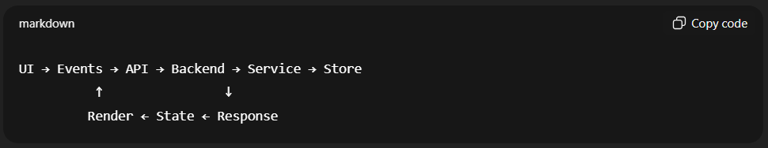

# Day 1 — Architecture First _(No Coding)_

## Objectives

> Build a clear, explainable mental model of the Note-Taking App before touching the keyboard.

## 1️⃣ Problem Definition _(Engineering, not features)_

**Problem statement _(strict)_:**

> A user can create, view, and delete notes. <br>
> Notes must survive frontend refresh. <br>
> System must tolerate bad inputs and unreliable network.

No UI fantasy. No styling talk. Only behavior.

## 2️⃣ System Boundary Definition _(MOST IMPORTANT)_

Draw this line in your head 👇

```
┌──────────────┐        ┌───────────────┐
│   Frontend   │  HTTP  │    Backend    │
│  (Browser)   │ <───>  │   (Node.js)   │
└──────────────┘        └───────────────┘
```

### Frontend is responsible for:

- User interaction
- Rendering notes
- Calling APIs
- Handling failures visually

### Backend is responsible for:

- Accepting requests
- Validating data
- Storing notes
- Returning responses

🚫 Frontend must **never**:

- Decide note IDs
- Assume data validity
- Guess backend state

🚫 Backend must **never**:

- Care about DOM
- Care about user clicks
- Assume UI correctness

This separation is sacred.

## 3️⃣ Data Contract _(Single Source of Truth)_

This is the **contract**, not an implementation.

```js
Note {
  id: string,
  title: string,
  content: string,
  createdAt: number
}
```

### Rules:

- `id` generated by backend
- `createdAt` generated by backend
- Frontend treats notes as **immutable** snapshots

This avoids sync hell later.

## 4️⃣ API Surface _(Minimal but Complete)_

We define **what exists**, not how it’s coded.

| Method | Route      | Purpose                 |
| ------ | ---------- | ----------------------- |
| GET    | /notes     | Fetch all notes         |
| POST   | /notes     | Create a new note       |
| PUT    | /notes/:id | Update an existing note |
| DELETE | /notes/:id | Delete a note           |
| GET    | /health    | Server health check     |

### Example request _(POST /notes)_

```json
{
  "title": "Meeting Notes",
  "content": "Discussed architecture"
}
```

### Example response

```json
{
  "id": "n_123",
  "title": "Meeting Notes",
  "content": "Discussed architecture",
  "createdAt": 1700000000000
}
```

### 🔁 Update Note — Contract Definition

Request

**PUT /notes/:id**

```json
{
  "title": "Updated meeting notes",
  "content": "Architecture finalized"
}
```

Rules:

- id comes only from URL
- Body contains only mutable fields
- Missing fields → validation failure
- Partial updates are not allowed _(no PATCH yet)_

### Why PUT and not PATCH?

> Because this keeps state transitions **explicit and predictable** in a learning system.

### Response _(Success)_

```json
{
  "id": "n_123",
  "title": "Updated meeting notes",
  "content": "Architecture finalized",
  "createdAt": 1700000000000
}
```

Backend guarantees:

- `id` unchanged
- `createdAt` unchanged
- Full note returned _(single source of truth)_

### Failure Scenarios _(Defined, not coded yet)_

| Case                  | Response                  |
| --------------------- | ------------------------- |
| Invalid JSON          | 400 Bad Request           |
| Missing title/content | 422 Unprocessable Entity  |
| Note not found        | 404 Not Found             |
| Server error          | 500 Internal Server Error |

These are **contracts**, not implementation details.

Backend owns **structure**. Frontend obeys.

### Why This Addition Is Architecturally Correct

✔ Maintains **clear state transitions** <br>
✔ Preserves **backend authority** <br>
✔ Avoids frontend guesswork <br>
✔ Prepares for failure training later _(Week 6)_

## 5️⃣ Data Flow _(One Direction Only)_

Golden Rule:

> Data flows down. Events flow up.

```
User Action
   ↓
Frontend Controller
   ↓
API Client
   ↓
Backend
   ↓
Response
   ↓
State Update
   ↓
UI Render
```

🚫 No shortcut DOM updates <br>
🚫 No UI mutating data directly

This is **React thinking without React**.

## 6️⃣ Internal Module Boundaries _(Mental Map)_

You’re not coding, but you must **see files in your head**.

### Frontend _(conceptual)_

```
/frontend
  ├── ui            → render only
  ├── state         → data only
  ├── api           → fetch only
  ├── controller    → glue logic
```

### Backend _(conceptual)_

```
/backend
  ├── server        → HTTP only
  ├── routes        → URL → action
  ├── services      → business logic
  ├── store         → data storage
  ├── logger        → observability
```

Each layer knows **only one layer below it**.

## 7️⃣ Failure as a First-Class Citizen _(Preview)_

Even today, list what can break:

- Network timeout
- Invalid JSON
- Empty request body
- Server crash
- Partial response

We are **not fixing them today**, only acknowledging reality.

## 8️⃣ Observability Philosophy _(Before Logs Exist)_

Define what must be observable later:

### Frontend:

- API call start
- API call end
- Failure reason

### Backend

- Incoming request
- Validation failure
- Processing time
- Crash cause

If something fails silently → architecture failed.

## 9️⃣ Day-1 Deliverables _(Non-Negotiable)_

By end of Day 1, you should have:

✅ A hand-drawn or markdown architecture diagram <br>
✅ A written data contract <br>
✅ A list of API routes <br>
✅ Clear ownership rules _(frontend vs backend)_ <br>
✅ A sentence explaining data flow

If you can’t explain this to someone else — **do not code tomorrow**.

## Final Thought _(Important)_

Most developers skip this day.
That’s why their apps become unmaintainable.

You’re doing what **senior engineers do instinctively**.

# Day 2 — Backend Skeleton

**Node.js · No frameworks · Reality-first**

## Objectives

> Build a minimal, observable HTTP server that you fully understand end-to-end.

## 0️⃣ Ground Rules _(Read Before Coding)_

❌ No Express / Fastify / frameworks <br>
❌ No database <br>
❌ No business logic yet <br>
✅ Raw http module <br>
✅ Manual routing <br>
✅ Manual logging <br>
✅ Explicit control over request & response

If something feels “verbose”, that’s the **point**.

## 1️⃣ What We Are Building Today _(Scope Lock)_

By end of Day 2, backend will have:

- A running HTTP server
- One real route: `GET /health`
- One placeholder route: `GET /notes` → returns `[]`
- A **manual logger**
- Clean separation:
  - HTTP layer
  - Routing
  - Logging

Nothing else

## 2️⃣ Mental Model: What Happens on Every Request

Before code, internalize this:

```pgsql
Client
  ↓
TCP connection
  ↓
Node http server
  ↓
Request object (req)
  ↓
Your routing logic
  ↓
Response object (res)
  ↓
Serialized HTTP response
```

Node does **not**:

- Parse JSON automatically
- Route automatically
- Log automatically

You do everything.

## 3️⃣ Folder Structure _(Minimal but Intentional)_

> commit hash **3a09b94**

Create this **exact structure**:

```pgsql
backend/
  ├── server.js
  ├── router.js
  └── logger.js
```

Each file has **one responsibility**.

## 4️⃣ logger.js — Observability Starts Here

> commit hash **287b26a**

> Logging is not debugging. <br>
> Logging is **system memory**.

```js
// logger.js

function log({ method, url, status, duration }) {
  const time = new Date().toISOString();

  console.log(`[${time}] ${method} ${url} ${status} ${duration}ms`);
}

module.exports = { log };
```

Why this shape?

- Structured
- Extendable
- No business coupling

## 5️⃣ router.js — Manual Routing _(No Magic)_

> commit hash **87d846b**

> Routing is **just decision making**.

```js
// router.js

function router(req, res) {
  const { method, url } = req;

  if (method === "GET" && url === "/health") {
    res.writeHead(200, { "Content-Type": "application/json" });
    res.end(JSON.stringify({ status: "ok" }));
    return;
  }

  if (method === "GET" && url === "/notes") {
    res.writeHead(200, { "Content-Type": "application/json" });
    res.end(JSON.stringify([]));
    return;
  }

  // fallback
  res.writeHead(404, { "Content-Type": "application/json" });
  res.end(JSON.stringify({ error: "Not Found" }));
}

module.exports = { router };
```

Important:

- `return` after response → **critical**
- Explicit headers → no guessing
- No try/catch yet (we want it to break loudly)

## 6️⃣ server.js — The HTTP Boundary

> commit hash **96f1b70**

This file **touches the network**. <br>
Everything else must stay pure.

```js
// server.js

const http = require("http");
const { router } = require("./router");
const { log } = require("./logger");

const PORT = 3000;

const server = http.createServer((req, res) => {
  const start = Date.now();

  res.on("finish", () => {
    const duration = Date.now() - start;

    log({
      method: req.method,
      url: req.url,
      status: res.statusCode,
      duration,
    });
  });

  router(req, res);
});

server.listen(PORT, () => {
  console.log(`Server running on http://localhost:${PORT}`);
});
```

Key ideas here:

- `res.on('finish')` → **true response lifecycle**
- Logging happens after response is sent
- Server knows nothing about routes

This is **clean separation**.

## 7️⃣ Test Like an Engineer _(Not a Coder)_

Use browser or curl.

### Health check

```bash
GET http://localhost:3000/health
```

Response:

```json
{ "status": "ok" }
```

Log:

```bash
[2026-01-19T15:12:01.234Z] GET /health 200 1ms
```

### Notes

```bash
GET http://localhost:3000/notes
```

Response:

```json
[]
```

### Invalid route

```bash
GET /random
```

response:

```json
{ "error": "Not Found" }
```

## 8️⃣ What You Must _Feel_ After Day 2

If Day 2 worked correctly, you should now:

- Understand **how Express works internally**
- Know where latency is measured
- Know who controls headers & status codes
- Realize how much magic frameworks hide

If you don’t feel this yet → reread and retype manually.

## 9️⃣ Common Mistakes _(Avoid These)_

❌ Putting logic in `server.js` <br>
❌ Logging before response finishes <br>
❌ Forgetting `return` after `res.end()` <br>
❌ Assuming JSON parsing exists <br>
❌ Adding POST logic today (too early)

## 1️⃣0️⃣ Day 2 Exit Criteria _(Hard Check_)

You are allowed to proceed only if:

- You can explain every line in `server.js`
- You know why `res.on('finish')` is used
- You can add a new route **without copying blindly**
- Logs make sense without reading code

# Day 3 — Backend Data Layer _(Services & Separation of Concerns)_

**Services · Separation of Concerns · Controlled State**

## Objectives

> Move all note-related logic out of routing and into a dedicated service layer, while keeping HTTP handling dumb.

## 0️⃣ Architectural Rule of the Day

> **Routes translate HTTP → intent** <br> > **Services execute business logic** <br> > **Server knows nothing about notes**

If a route _decides_ anything → it’s doing too much.

## 1️⃣ What Changes Today _(Scope Lock)_

By end of Day 3, backend will have:

- A **notes service** responsible for:

  - Creating notes
  - Reading notes

- In-memory storage _(array)_

- Routes that:

  - Delegate logic
  - Handle HTTP concerns only

- Logs that show:
  - When service logic runs
  - How long it takes

❌ No persistence <br>
❌ No POST body parsing errors handling yet _(comes Day 6)_

## 2️⃣ Folder Structure _(Evolved, Still Minimal)_

> commit hash **db625b0**

Update backend structure to:

```markdown
backend/
├── server.js
├── router.js
├── logger.js
├── services/
│ └── notes.service.js
└── store/
└── notes.store.js
```

This is **separation by responsibility**, not by type.

## 3️⃣ notes.store.js — Controlled State

> commit hash **ee9fc04**

State should be boring and predictable.

```js
// store/notes.store.js

const notes = [];

function getAll() {
  return notes;
}

function add(note) {
  notes.push(note);
  return note;
}

module.exports = {
  getAll,
  add,
};
```

Rules:

- No IDs generated here
- No timestamps here
- No HTTP here

Store only stores.

## 4️⃣ notes.service.js — Business Logic Lives Here

> commit hash **95f1b65**

This is the **brain** of the backend.

```js
// services/notes.service.js

const store = require("../store/notes.store");

function createNote({ title, content }) {
  const note = {
    id: `n_${Date.now()}`,
    title,
    content,
    createdAt: Date.now(),
  };

  return store.add(note);
}

function getNotes() {
  return store.getAll();
}

module.exports = {
  createNote,
  getNotes,
};
```

Why here?

- ID generation = business decision
- Timestamp = business decision
- Data shape = business decision

## 5️⃣ router.js — Routes Become Thin

> commit hash **64a86d3**

Now routing becomes **translation only**.

```js
const { createNote, getNotes } = require("./services/notes.service");

function router(req, res) {
  const { method, url } = req;

  if (method === "GET" && url === "/health") {
    res.writeHead(200, { "Content-Type": "application/json" });
    res.end(JSON.stringify({ status: "ok" }));
    return;
  }

  if (method === "GET" && url === "/notes") {
    const notes = getNotes();
    res.writeHead(200, { "Content-Type": "application/json" });
    res.end(JSON.stringify(notes));
    return;
  }

  if (method === "POST" && url === "/notes") {
    let body = "";

    req.on("data", (chunk) => {
      body += chunk.toString();
    });

    req.on("end", () => {
      const parsed = JSON.parse(body); // intentionally unsafe (for now)
      const note = createNote(parsed);

      res.writeHead(201, { "Content-Type": "application/json" });
      res.end(JSON.stringify(note));
    });

    return;
  }

  // fallback
  res.writeHead(404, { "Content-Type": "application/json" });
  res.end(JSON.stringify({ error: "Not Found" }));
}

module.exports = { router };
```

⚠️ We are **deliberately** not handling JSON errors yet. <br>
Failure training is coming.

## 6️⃣ Logging Service Execution _(Observability Upgrade)_

> commit hash **e49767a**

Modify `notes.service.js`:

```js
const store = require("../store/notes.store");

function createNote({ title, content }) {
  const start = Date.now();

  const note = {
    id: `n_${Date.now()}`,
    title,
    content,
    createdAt: Date.now(),
  };

  const result = store.add(note);

  console.log(`[SERVICE] createNote executed in ${Date.now() - start}ms`);

  return result;
}

function getNotes() {
  return store.getAll();
}

module.exports = {
  createNote,
  getNotes,
};
```

Later, this moves to a logger. <br>
Today, we just **see execution boundaries**.

## 7️⃣ Test Like a System _(Not Just Endpoints)_

### Create a note

```bash
POST /notes
{
  "title": "Day 3",
  "content": "Separation of concerns"
}
```

Response:

```json
{
  "id": "n_170...",
  "title": "Day 3",
  "content": "Separation of concerns",
  "createdAt": 170...
}
```

Logs:

```bash
[SERVICE] createNote executed in 0ms
[2026-01-20T...] POST /notes 201 3ms
```

You now see:

- Business logic time
- HTTP lifecycle time

That’s observability.

### [EXTRAS] How to Send a POST Request

#### ✅ Option 1: Using `Invoke-WebRequest`

```powershell
Invoke-WebRequest `
  -Uri http://localhost:3000/notes `
  -Method POST `
  -Headers @{ "Content-Type" = "application/json" } `
  -Body '{"title":"Day 3","content":"Separation of concerns"}'
```

or:

Using `curl`

```bash
curl -X POST http://localhost:3000/notes \
  -H "Content-Type: application/json" \
  -d '{"title":"Day 3","content":"Separation of concerns"}'
```

#### ✅ Option 2: Using Browser `fetch` _(Temporary Test)_

Open **Chrome DevTools → Console** and paste:

```js
fetch("http://localhost:3000/notes", {
  method: "POST",
  headers: {
    "Content-Type": "application/json",
  },
  body: JSON.stringify({
    title: "From Browser",
    content: "Testing POST",
  }),
})
  .then((res) => res.json())
  .then(console.log)
  .catch(console.error);
```

This simulates **exactly what your frontend will do later**.

## 8️⃣ What You’ve Actually Learned Today

Without realizing, you now understand:

- Why fat controllers are bad
- Why business logic must be testable without HTTP
- How databases fit later without rewriting routes
- Why microservices enforce service boundaries

You are **writing backend like a senior**, not a tutorial follower.

## 9️⃣ Day 3 Exit Criteria (Non-Negotiable)

Proceed only if you can:

- Move storage to a file **without touching router**
- Add a new note field **without touching server.js**
- Explain why ID generation is not in the store
- Explain why routes are intentionally dumb

If not — stop and refactor.

# Day 4 — Frontend Skeleton

**Vanilla JS · UI ≠ Data · No Backend Yet**

## Objectives

> Build a frontend that can render notes **without knowing where they come from**.

If you do Day 4 correctly, plugging in the backend tomorrow will feel _boringly_ easy.

## 0️⃣ Ground Rules _(Non-Negotiable)_

❌ No fetch yet <br>
❌ No backend calls <br>
❌ No global mutable chaos <br>
❌ No DOM manipulation from random places <br>
✅ UI renders from state <br>
✅ Events only request state changes

Think **React without React**.

## 1️⃣ Mental Model First _(Read Slowly)_

```nginx
STATE  →  UI
EVENTS →  STATE
```

- UI never mutates data
- Events never touch DOM directly
- There is **one source of truth**

If you violate this today, you’ll suffer on Day 5.

## 2️⃣ Folder Structure _(Frontend Begins)_

> commit hash **3cd9dee**

Create this structure:

```matlab
frontend/
  ├── index.html
  ├── main.js
  ├── state/
  │     └── notes.state.js
  ├── ui/
  │     └── notes.ui.js
  └── events/
        └── notes.events.js
```

Each folder answers **one question**:

- `state` → what data exists
- `ui` → how data is shown
- `events` → what user does

## 3️⃣ index.html — Dumb HTML Only

> commit hash **2c5a74d**

HTML must be **boring**.

```html
<!DOCTYPE html>
<html>
  <head>
    <meta charset="UTF-8" />
    <title>Notes</title>
  </head>
  <body>
    <h1>Notes</h1>

    <form id="note-form">
      <input id="title" placeholder="Title" />
      <textarea id="content" placeholder="Content"></textarea>
      <button type="submit">Add</button>
    </form>

    <ul id="notes-list"></ul>

    <script type="module" src="./main.js"></script>
  </body>
</html>
```

❌ No inline JS <br>
❌ No logic in HTML

## 4️⃣ notes.state.js — Single Source of Truth

> commit hash **27fe4de**

This replaces your database _(for now)_.

```js
// state/notes.state.js

let notes = [];

function getNotes() {
  return notes;
}

function setNotes(newNotes) {
  notes = newNotes;
}

function addNote(note) {
  notes = [...notes, note];
}

export { getNotes, setNotes, addNote };
```

Rules:

- No DOM
- No events
- No assumptions about backend

## 5️⃣ notes.ui.js — Rendering Only

> commit hash **4ca0219**

UI is a **pure function of state**.

```js
// ui/notes.ui.js

import { getNotes } from "../state/notes.state.js";

const listEl = document.getElementById("notes-list");

function renderNotes() {
  const notes = getNotes();

  listEl.innerHTML = "";

  notes.forEach((note) => {
    const li = document.createElement("li");
    li.textContent = `${note.title}: ${note.content}`;
    listEl.appendChild(li);
  });
}

export { renderNotes };
```

UI does:

- Read state
- Paint DOM

Nothing else.

## 6️⃣ notes.events.js — User Intent Only

> commit hash **a45f777**

Events **request changes**, they don’t enforce them.

```js
// events/notes.event.js

import { addNote } from "../state/notes.state.js";
import { renderNotes } from "../ui/notes.ui.js";

const form = document.getElementById("note-form");

function initEvents() {
  form.addEventListener("submit", (e) => {
    e.preventDefault();

    const title = document.getElementById("title").value;
    const content = document.getElementById("content").value;

    addNote({
      id: Date.now(),
      title,
      content,
    });

    renderNotes();
    form.reset();
  });
}

export { initEvents };
```

Yes — we’re generating IDs here **temporarily**. <br>
We’ll kill this tomorrow.

## 7️⃣ main.js — The Glue _(Nothing Else)_

> commit hash **8c9cf48**

```js
// main.js

import { initEvents } from "./events/notes.events.js";
import { renderNotes } from "./ui/notes.ui.js";

initEvents();
renderNotes();
```

That’s it. <br>
If `main.js` grows → architecture failed.

## 8️⃣ Test Like a Frontend Engineer

Open `index.html` in browser.

- Add notes
- Refresh page → notes disappear _(expected)_
- UI updates only via `renderNotes()`

If UI changes **without calling render** → bug.

## 9️⃣ What You’ve Actually Learned Today

Without React, you just learned:

- State-driven UI
- Controlled data flow
- Why React exists
- Why DOM mutation sprawl is evil

Most people learn this **after** frameworks. <br>
You learned it **before**.

## 🔍 Day 4 Exit Criteria

You’re ready only if:

- You can replace `addNote()` with API call tomorrow
- UI code never touches form inputs
- Events never touch DOM structure
- You understand why refresh loses data

# Day 5 — Frontend ↔ Backend Communication

**Fetch · Data Flow Discipline · Zero Shortcut DOM Updates**

## Objectives

Connect frontend to backend **without breaking Day-4 architecture**.

Backend already exists. <br>
Frontend already exists. <br>
Today we **connect them without letting them leak into each other**.

## 0️⃣ The One Rule You Must Not Break

> UI never talks to backend <br>
> Events never mutate UI directly <br>
> API never touches DOM

If you violate this once, stop and refactor.

## 1️⃣ Updated Mental Model (Lock This In)

```pgsql
User Event
   ↓
Event Handler
   ↓
API Client (fetch)
   ↓
Backend
   ↓
Response
   ↓
State Update
   ↓
UI Render
```

❌ No “just update DOM quickly” <br>
❌ No “I’ll console.log and see” <br>
❌ No “fetch inside UI”

## 2️⃣ New Folder: API Layer _(This Is the Firewall)_

> commit hash **2fe244f**

Add a new folder:

```matlab
frontend/
  ├── api/
  │     └── notes.api.js
```

This file is the **only place** allowed to call `fetch`.

## 3️⃣ notes.api.js — Backend Contract in Code

> commit hash **cf03445**

```js
// api/notes.api.js

const BASE_URL = "http://localhost:3000";

async function fetchNotes() {
  const res = await fetch(`${BASE_URL}/notes`);

  if (!res.ok) {
    throw new Error("Failed to fetch notes");
  }

  return res.json();
}

async function createNote({ title, content }) {
  const res = await fetch(`${BASE_URL}/notes`, {
    method: "POST",
    headers: {
      "Content-Type": "application/json",
    },
    body: JSON.stringify({ title, content }),
  });

  if (!res.ok) {
    throw new Error("Failed to create note");
  }

  return res.json();
}

export { fetchNotes, createNote };
```

Rules:

- No DOM
- No state
- No UI logic
- Only HTTP + JSON

## 4️⃣ Update Events — This Is the Critical Change

> commit hash **a15600e**

### ❌ Old behavior

- Event → addNote → render

### ✅ New behavior

- Event → API → state → render

Update `notes.events.js`:

```js
// events/notes.event.js

import { createNote } from "../api/notes.api.js";
import { addNote } from "../state/notes.state.js";
import { renderNotes } from "../ui/notes.ui.js";

const form = document.getElementById("note-form");

function initEvents() {
  form.addEventListener("submit", async (e) => {
    e.preventDefault();

    const title = document.getElementById("title").value;
    const content = document.getElementById("content").value;

    try {
      const createdNote = await createNote({ title, content });

      addNote(createdNote);
      renderNotes();
      form.reset();
    } catch (error) {
      alert("Failed to save note");
      console.error(error);
    }
  });
}

export { initEvents };
```

⚠️ Notice:

- Event handler is now `async`
- Backend owns ID + timestamp
- UI only re-renders after state update

## 5️⃣ Load Notes on Page Load _(Initial Sync)_

> commit hash **fd6d29c**

Update `main.js`:

```js
// main.js

import { initEvents } from "./events/notes.events.js";
import { renderNotes } from "./ui/notes.ui.js";
import { setNotes } from "./state/notes.state.js";
import { fetchNotes } from "./api/notes.api.js";

async function initApp() {
  try {
    const notes = await fetchNotes();

    setNotes(notes);
    renderNotes();
  } catch (error) {
    alert("Failed to load notes");
    console.error(error);
  }

  initEvents();
}

initApp();
```

This is **frontend bootstrapping**.

## 6️⃣ Test the Full System _(End-to-End)_

### Step 1

Start backend:

```nginx
node server.js
```

### Step 2

Open frontend (`index.html`)

### Step 3

Expected behavior:

- Existing notes load on refresh ✅
- New note appears after submit ✅
- IDs come from backend ✅
- Logs show POST + GET ✅

## 7️⃣ Very Common Mistakes _(STOP IF YOU DO THESE)_

❌ Calling fetch inside UI <br>
❌ Updating DOM before API success <br>
❌ Storing raw form values in state <br>
❌ Letting frontend generate IDs <br>
❌ Swallowing errors silently

If any of these exist → refactor immediately.

## 8️⃣ What You Just Achieved _(This Is Huge)_

You now have:

- Clear frontend ↔ backend contract
- Predictable data flow
- Zero DOM-state desync
- Backend authority
- Replaceable backend _(tomorrow you could swap it)_

This is **framework-grade architecture** without a framework.

## 🔍 Day 5 Exit Criteria _(Be Honest)_

Proceed only if you can say YES to all:

- Refreshing page reloads notes from backend
- Removing backend breaks app clearly
- No file violates its responsibility
- You can explain the full data flow aloud

## [optional] Browser Reality - CORS Policy!

CORS blocking is not a bug — this is the **browser doing its job**.

### ❗ What This Error REALLY Means

```pgsql
Access to fetch at 'http://localhost:3000/notes'
from origin 'http://localhost:5500'
has been blocked by CORS policy
```

**Translation:**

- Frontend is running on **origin A**

  `http://localhost:5500`

- Backend is running on **origin B**

http://localhost:3000

Browser says:

> _“Hey JS, you’re trying to talk cross-origin.
> I need explicit permission from the server.”_

👉 **CORS is a browser security rule**, not Node, not fetch, not your code.

> CORS is enforced by the browser, not the server

### ✅ The Fix _(Raw Node, No Libraries)_

> commit hash **1d4f0c5**

Update `server.js` in backend _(Minimal & Correct)_

```js
const http = require("http");
const { router } = require("./router");
const { log } = require("./logger");

const PORT = 3000;

const server = http.createServer((req, res) => {
  const start = Date.now();

  // ✅ CORS HEADERS (GLOBAL)
  res.setHeader("Access-Control-Allow-Origin", "*");
  res.setHeader("Access-Control-Allow-Methods", "GET,POST,PUT,DELETE,OPTIONS");
  res.setHeader("Access-Control-Allow-Headers", "Content-Type");

  // ✅ Handle preflight requests
  if (req.method === "OPTIONS") {
    res.writeHead(204);
    res.end();
    return;
  }

  res.on("finish", () => {
    const duration = Date.now() - start;

    log({
      method: req.method,
      url: req.url,
      status: res.statusCode,
      duration,
    });
  });

  router(req, res);
});

server.listen(PORT, () => {
  console.log(`Server running on http://localhost:${PORT}`);
});
```

Why this works:

- Browser sends an **OPTIONS preflight**
- You respond cleanly
- Browser is satisfied
- Real request proceeds

> **Restart is Mandatory**

# Day 6 — Validation & Defensive Coding

**Trust Nothing · Fail Loud · Fail Clean**

## Objectives

> Make the system resilient to bad input, bad JSON, and partial failure — without breaking architecture.

## 0️⃣ The Core Mindset Shift _(Lock This In)_

> If invalid data enters your system, architecture has already failed.

Validation is **not polish**. <br>
Validation is **system integrity**.

## 1️⃣ What We Will Defend Against _(Explicit List)_

By end of Day 6, your app must survive:

### Backend-side

❌ Invalid JSON <br>
❌ Empty body <br>
❌ Missing title / content <br>
❌ Non-string values <br>
❌ Double responses _(already fixed earlier)_

### Frontend-side

❌ Empty inputs <br>
❌ API failure <br>
❌ Backend validation errors

No silent failures. Ever.

## 2️⃣ Backend: JSON Parsing Must Not Kill the Server

> commit hash **18dfe92**

❌ Current dangerous code

```js
const parsed = JSON.parse(body); // 💥 crash if invalid
```

### ✅ Defensive fix _(router.js)_

```js
req.on("end", () => {
  let parsed;

  try {
    parsed = JSON.parse(body);
  } catch (error) {
    res.writeHead(400, { "Content-Type": "application/json" });
    res.end(JSON.stringify({ error: "Invalid JSON" }));
    return;
  }

  const note = createNote(parsed);

  res.writeHead(201, { "Content-Type": "application/json" });
  res.end(JSON.stringify(note));
});
```

🧠 Key insight:

- **JSON.parse is a trust boundary**
- Trust boundaries must always have `try/catch`

## 3️⃣ Backend: Validate Business Data _(Service Layer)_

> commit hash **5cbae2b**

Validation logic **does NOT belong in routes**.

### Add validation inside `notes.service.js`

```js
function createNote({ title, content }) {
  if (!title || !content) {
    throw new Error("Missing fields");
  }

  if (typeof title !== "string" || typeof content !== "string") {
    throw new Error("Invalid field types");
  }

  const note = {
    id: `n_${Date.now()}`,
    title: title.trim(),
    content: content.trim(),
    createdAt: Date.now(),
  };

  return store.add(note);
}
```

Now service **protects invariants**.

## 4️⃣ Catch Service Errors in Router _(Translation Layer)_

> commit hash **6220e84**

Routes **translate exceptions → HTTP responses**.

### Update POST handler in `router.js`

```js
try {
  const note = createNote(parsed);

  res.writeHead(201, { "Content-Type": "application/json" });
  res.end(JSON.stringify(note));
} catch (error) {
  res.writeHead(422, { "Content-Type": "application/json" });
  res.end(JSON.stringify({ error: error.message }));
}
```

🧠 Important:

- Service throws
- Router decides HTTP meaning
- Service stays HTTP-agnostic

## 5️⃣ Frontend: Validate Before Calling Backend

> commit hash **c48caac**

Frontend validation is about **UX**, not security.

### Update `notes.events.js`

```js
if (!title.trim() || !content.trim()) {
  alert("Title and content are required");
  return;
}
```

Why still validate on backend? <br>
👉 Because frontend can be bypassed.

### 6️⃣ Frontend: Handle Backend Errors Gracefully

> commit hash **7d6cf53**

### Update API layer (`notes.api.js`)

```js
async function createNote({ title, content }) {
  const res = await fetch(`${BASE_URL}/notes`, {
    method: "POST",
    headers: { "Content-Type": "application/json" },
    body: JSON.stringify({ title, content }),
  });

  const data = await res.json();

  if (!res.ok) {
    throw new Error(data.error || "Failed to create note");
  }

  return data;
}
```

Now backend errors **flow upward cleanly**.

## 7️⃣ Frontend: Surface Errors Without Breaking Flow

> commit hash **1dfb238**

In `notes.events.js`:

```js
try {
  const createdNote = await createNote({ title, content });
  addNote(createdNote);
  renderNotes();
  form.reset();
} catch (err) {
  alert(err.message);
}
```

❌ No console-only errors <br>
❌ No silent failures

## 8️⃣ Test Like a Chaos Engineer

Try these **deliberately**:

### Backend crash tests

- Send invalid JSON
- Send empty body
- Send { "title": 123 }

**Expected:**

- Server does NOT crash
- Proper status code
- Clear error message

### Frontend tests

- Submit empty form
- Kill backend, then submit
- Refresh page with backend down

**Expected:**

- App fails clearly
- UI stays responsive
- No broken state

## 🔍 Day 6 Exit Criteria _(Be Brutally Honest)_

You may proceed only if:

- Invalid JSON does NOT crash server
- Missing fields return 422
- Frontend never sends empty data
- Errors propagate cleanly
- You understand why validation lives where it does

If you can’t explain that last point → stop.

## 🧠 What You Actually Learned Today

- Trust boundaries
- Defense in depth
- Why services exist
- Why APIs return 4xx
- Why “happy path only” code is amateur code

This is **production thinking**.

# Day 7 — Week 1 Review, Refactor & Architecture Lock

**Stabilize · Simplify · Explainability Test**

## Objectives

> Ensure your system is **clean, predictable, explainable**, and ready to be **intentionally** broken next week.

## 1️⃣ First: Architecture Sanity Check

Before opening the editor, answer these out loud:

### Frontend

- Who owns data? → **state**
- Who touches DOM? → **ui**
- Who talks to backend? → **api**
- Who coordinates flow? → **events**
- Does any file violate this? → If yes, refactor

### Backend

- Who handles HTTP? → **server + router**
- Who enforces rules? → **services**
- Who stores data? → **store**
- Who logs? → **logger**
- Does any layer know too much? → Fix it

If you can’t answer instantly, something is leaking.

## 2️⃣ Backend Refactor Pass _(Minimal, Surgical)_

### ✅ Check 1: `server.js`

Must contain only:

- HTTP server creation
- CORS handling
- Request timing
- Logging hook
- Call to router

❌ If you see:

- Note logic
- Validation
- JSON parsing

→ **Architecture violation**

### ✅ Check 2: `router.js`

Must do **only translation**:

- HTTP → service call
- service error → HTTP status
- No business rules

**Good smell:**

```js
try {
  serviceCall()
} catch {
  res.writeHead(...)
}
```

**Bad smell:**

```js
if (!title) { ... } // ❌ belongs in service
```

### ✅ Check 3: `notes.service.js`

Must:

- Enforce invariants
- Validate business data
- Decide IDs & timestamps

Must NOT:

- Touch `req`, `res`
- Set status codes
- Log HTTP stuff

If tomorrow you swap HTTP with CLI — service should still work.

### ✅ Check 4: store

Ask:

> “Can I replace this with a database without touching services?”

If answer ≠ yes → refactor.

## 3️⃣ Frontend Refactor Pass _(This Is Crucial)_

### ✅ UI layer (`ui/`)

- Reads from state
- Renders DOM
- No fetch
- No event listeners

If UI calls fetch → **hard stop**

### ✅ State layer (`state/`)

- Pure data
- No DOM
- No fetch
- No side effects

State should feel _boring_.

### ✅ API layer (`api/`)

- Only `fetch`
- Throws errors upward
- No alert
- No DOM
- No state mutation

API is a **thin wire**, nothing else.

### ✅ Events layer (`events/`)

- Reads input values
- Calls API
- Updates state
- Triggers render

Events are the **orchestrator**, not the executor.

## 4️⃣ Kill Accidental Complexity _(Important)_

Now actively remove: <br>
❌ Dead console.logs <br>
❌ Commented-out experiments <br>
❌ Duplicate logic <br>
❌ Inline JSON literals repeated in many places <br>
❌ Magic strings scattered around <br>

Replace magic with **clear constants** if needed.

## 5️⃣ Observability Review _(Week 1 Level)_

Ask yourself:

### Backend

- Can I see:

  - request start?
  - request end?
  - status code?
  - duration?

- Can I tell where it failed?

### Frontend

- Can I distinguish:
  - validation error?
  - network error?
  - server error?

If two failures look the same → observability is weak.

## 6️⃣ The Explainability Test _(Non-Negotiable)_

You must be able to answer **all** of these:

- Why is validation duplicated?
- Why doesn’t UI call fetch?
- Why does service throw errors instead of returning flags?
- Why is CORS in `server.js`?
- What breaks if backend is down?

If even one answer is fuzzy → revisit that area.

### 7️⃣ Day 7 Exit Criteria _(Hard Gate)_

You are allowed to proceed only if: <br>
✅ No file violates its responsibility <br>
✅ You can delete console.logs safely <br>
✅ README explains system clearly <br>
✅ You feel _bored_, not excited <br>

> Bored = stable <br>
> Excited = chaos

## 🧠 What You Actually Achieved in Week 1 _(Month 2)_

You didn’t build a “note app”.

You built:

- A clean frontend architecture _(without React)_
- A layered backend _(without Express)_
- A predictable data flow
- A system that can be **reasoned about**

This is **engineering**, not coding.

## Final Verdict: Force Yourself to Explain

### 1. Architecture Diagram _(ASCII is fine)_



### 2. Data Flow _(1 paragraph)_

Explain the flow of creating a note — no code.

### 3. Failure Philosophy

- What you validate on frontend
- What you validate on backend
- Why

If you can’t write this clearly → system isn’t clear.

## Day 8 — Logging as a First-Class Feature

**Observability > Debugging**

## Objectives

> Make your system explain itself **without opening the code**.

From today onward:

- `console.log()` is **not allowed**
- Logs are **structured**
- Logs answer **questions**, not emotions

## 0️⃣ Mental Reset _(Very Important)_

Most developers use logs like this:

```js
console.log("here");
console.log("inside if");
console.log(data);
```

That is **panic logging**.

We are doing **diagnostic logging**.

A good log answers:

- "What happened"?
- "Where?"
- "Why?"
- "How long did it take?"

## 1️⃣ Define Logging Levels _(Before Code)_

We will use **four levels** _(simple, no overengineering)_:

| Level | Meaning              | Example           |
| ----- | -------------------- | ----------------- |
| INFO  | Normal system events | Request received  |
| WARN  | Recoverable issues   | Validation failed |
| ERROR | System failure       | JSON parse error  |
| DEBUG | Internal details     | Payload size      |

We are **not implementing filters yet** — just labeling.

## 2️⃣ Backend: Upgrade Logger _(Core of the Day)_

> commit hash **78df0fa**

### ❌ Old logger _(too weak)_

```js
console.log(...)
```

### ✅ New structured logger _(logger.js)_

```js
// backend/logger.js

function log(level, message, meta = {}) {
  const entry = {
    time: new Date().toISOString(),
    level,
    message,
    ...meta,
  };

  console.log(JSON.stringify(entry));
}

module.exports = { log };
```

Why JSON?

- Machine-readable
- Searchable
- Production-grade habit

## 3️⃣ Backend: Log Request Lifecycle _(Server Layer)_

> commit hash **00fd6fa**

Update `server.js`

```js
const http = require("http");
const { router } = require("./router");
const { log } = require("./logger");

const PORT = 3000;

const server = http.createServer((req, res) => {
  const start = Date.now();

  // ✅ CORS HEADERS (GLOBAL)
  res.setHeader("Access-Control-Allow-Origin", "*");
  res.setHeader("Access-Control-Allow-Methods", "GET,POST,PUT,DELETE,OPTIONS");
  res.setHeader("Access-Control-Allow-Headers", "Content-Type");

  // ✅ Handle preflight requests
  if (req.method === "OPTIONS") {
    res.writeHead(204);
    res.end();
    return;
  }

  log("INFO", "Request received", {
    method: req.method,
    url: req.url,
  });

  res.on("finish", () => {
    log("INFO", "Request completed", {
      method: req.method,
      url: req.url,
      status: res.statusCode,
      duration: `${Date.now() - start}ms`,
    });
  });

  router(req, res);
});

server.listen(PORT, () => {
  console.log(`Server running on http://localhost:${PORT}`);
});
```

Now every request:

- has a start log
- has an end log
- has duration
- has status

You can replay traffic mentally.

## 4️⃣ Backend: Log Validation Failures _(Service Layer)_

> commit hash **8d3c3c4**

Update `notes.service.js`

```js
const { log } = require("../logger");
const store = require("../store/notes.store");

function createNote({ title, content }) {
  if (!title || !content) {
    log("WARN", "Validation failed: missing fields", {
      titlePresent: !!title,
      contentPresent: !!content,
    });
    throw new Error("Missing Fields");
  }

  if (typeof title !== "string" || typeof content !== "string") {
    log("WARN", "Validation failed: invalid types", {
      titleType: typeof title,
      contentType: typeof content,
    });
    throw new Error("Invalid field types");
  }

  const start = Date.now();

  const note = {
    id: `n_${Date.now()}`,
    title,
    content,
    createdAt: Date.now(),
  };

  const result = store.add(note);

  log("INFO", "Note created", { id: note.id });

  return result;
}

function getNotes() {
  return store.getAll();
}

module.exports = {
  createNote,
  getNotes,
};
```

Key idea:

- Logs describe **intent + outcome**
- Not raw data dumps

## 5️⃣ Backend: Log JSON Parse Errors _(Router Layer)_

> commit hash **65a60f8**

In `router.js`:

```js
try {
  parsed = JSON.parse(body);
} catch (error) {
  log("ERROR", "Invalid JSON received", {
    bodySnippet: body.slice(0, 50),
  });

  res.writeHead(400, { "Content-Type": "application/json" });
  res.end(JSON.stringify({ error: "Invalid JSON" }));
  return;
}
```

Notice:

- ERROR level
- No full payload logging _(security habit)_
- Still graceful response

## 6️⃣ Frontend: Logging Without console.log Abuse

> commit hash **c2b51f8**

Create:

```bash
frontend/logger.js
```

```js
// frontend/logger.js

export function log(level, message, meta = {}) {
  console[level === "ERROR" ? "error" : "log"]({
    time: new Date().toISOString(),
    level,
    message,
    ...meta,
  });
}
```

This keeps **logging centralized**.

## 7️⃣ Frontend: Log API Lifecycle

> commit hash **bd2cf27**

Update `notes.api.js`:

```js
import { log } from "../logger.js";

const BASE_URL = "http://localhost:3000";

async function fetchNotes() {
  log("INFO", "Fetching notes");

  const start = Date.now();
  const res = await fetch(`${BASE_URL}/notes`);

  log("INFO", "Fetch notes response", {
    status: res.status,
    duration: Date.now() - start,
  });

  if (!res.ok) {
    log("ERROR", "Fetch notes failed");
    throw new Error("Failed to fetch notes");
  }

  return res.json();
}

async function createNote({ title, content }) {
  const res = await fetch(`${BASE_URL}/notes`, {
    method: "POST",
    headers: {
      "Content-Type": "application/json",
    },
    body: JSON.stringify({ title, content }),
  });

  const data = await res.json();

  if (!res.ok) {
    throw new Error(data.error || "Failed to create note");
  }

  return data;
}

export { fetchNotes, createNote };
```

Now frontend logs:

- Intent
- Duration
- Outcome

## 8️⃣ What Logs Should Look Like Now

### Backend

```json
{
  "time": "2026-01-26T14:01:22Z",
  "level": "INFO",
  "message": "Request completed",
  "method": "POST",
  "url": "/notes",
  "status": 201,
  "duration": 4
}
```

### Frontend

```js
{
  time: "2026-01-26T14:01:22Z",
  level: "INFO",
  message: "Fetch notes response",
  status: 200,
  duration: 12
}
```

You can now debug **without stepping through code**.

## 9️⃣ Kill These Anti-Patterns Immediately

❌ `console.log(data)` <br>
❌ Logs without context <br>
❌ Logs without timestamps <br>
❌ Logs inside UI render loops <br>
❌ Logs only on success

If logs exist only when things work → they are useless.

## 🔍 Day 8 Exit Criteria _(Hard)_

You may proceed only if:

✅ Every request is logged start → end <br>
✅ Validation failures appear as WARN <br>
✅ Crashes appear as ERROR <br>
✅ Frontend logs show API timing <br>
✅ You can diagnose a failure using logs alone

## 🧠 What Changed in You Today

You stopped asking:

> “Why is this not working?”

You started asking:

> “What does the system say happened?”

That’s the difference between **debugging** and **engineering**.

# Day 9 — API Timeout Simulation

**Slow Network · Hung Requests · Controlled Failure**

## Objectives

Teach your system to **stop waiting, report clearly**, and **recover gracefully** when the backend is slow or stuck.

## 0️⃣ Core Reality Check _(Internalize This)_

> HTTP has **no built-in timeout**.

If the server:
- hangs
- delays
- forgets to respond

👉 `fetch()` will wait forever.

If you don’t design for this, your UI freezes politely… forever.

## 1️⃣ What We Are Simulating Today

We will deliberately create:

### Backend-side failures

- Artificial response delay
- Requests that take _too long_

### Frontend-side defenses

- Client-side timeout
- Abort in-flight requests
- Clear timeout error

No retries yet _(Day 12)_.

## 2️⃣ Backend: Introduce Artificial Latency _(Controlled Sabotage)_

> commit hash **967b5e3**

### Add delay utility _(backend/utils/delay.js)_

```js
// utils/delay.js
function delay(ms) {
  return new Promise(resolve => setTimeout(resolve, ms));
}

module.exports = { delay };
```

### Inject delay into notes route _(router.js)_

At the top of `/notes` GET handler:

```js
const { delay } = require('./utils/delay');
```

Then:

```js
if (method === 'GET' && url === '/notes') {
  (async () => {
    await delay(5000); // ⏱ 5 seconds — intentional

    const notes = getNotes();
    res.writeHead(200, { 'Content-Type': 'application/json' });
    res.end(JSON.stringify(notes));
  })();

  return;
}
```

🔥 This simulates:

- slow database
- congested server
- cold start

Your backend is now **hostile by design**.

## 3️⃣ Observe the Failure _(Do NOT Fix Yet)_

Reload frontend.

What happens?

- UI appears frozen
- No feedback
- No error
- User confused

This is **expected**. <br>
Now we fix it **properly**.

## 4️⃣ Frontend: Implement Fetch Timeout _(Correct Way)_

> commit hash **2b17ae9**

There is only **one correct way**: 👉 `AbortController`

### Create timeout wrapper _(frontend/api/fetchWithTimeout.js)_

```js
// api/fetchWithTimeout.js
export async function fetchWithTimeout(url, options = {}, timeout = 3000) {
  const controller = new AbortController();
  const id = setTimeout(() => controller.abort(), timeout);

  try {
    const response = await fetch(url, {
      ...options,
      signal: controller.signal
    });
    return response;
  } finally {
    clearTimeout(id);
  }
}
```

This gives you **real cancellation**, not fake timers.

## 5️⃣ Use Timeout Wrapper in API Layer

> commit hash 2bea929

Update `notes.api.js`:

```js
import { fetchWithTimeout } from './fetchWithTimeout.js';
import { log } from '../logger.js';

async function fetchNotes() {
  log('INFO', 'Fetching notes (with timeout)');

  const start = Date.now();

  let res;
  try {
    res = await fetchWithTimeout(
      `${BASE_URL}/notes`,
      {},
      3000 // 3 seconds timeout
    );
  } catch (err) {
    if (err.name === 'AbortError') {
      log('ERROR', 'Fetch notes timed out');
      throw new Error('Request timed out');
    }
    throw err;
  }

  log('INFO', 'Fetch notes response', {
    status: res.status,
    duration: Date.now() - start
  });

  if (!res.ok) {
    throw new Error('Failed to fetch notes');
  }

  return res.json();
}
```

Now:
- frontend refuses to wait forever
- timeout is explicit
- error is meaningful

## 6️⃣ Frontend UX: Surface Timeout Clearly

> commit hash **eccbac4**

In `main.js`:

```js
try {
  const notes = await fetchNotes();
  setNotes(notes);
  renderNotes();
} catch (err) {
  alert(err.message); // later → proper UI
}
```

Timeout message should be **distinct**, not generic.

## 7️⃣ Logs Are the Real Test

### Frontend log _(timeout)_

```js
{
  level: "ERROR",
  message: "Fetch notes timed out"
}
```

### Backend log _(still finishes later)_

```json
{
  "level":"INFO",
  "message":"Request completed",
  "duration":5002
}
```

🧠 Insight:

- Backend did its job
- Frontend chose to stop waiting
- Both are correct

This is **distributed systems reality**.

## 8️⃣ Important Rule _(Do NOT Break This)_

❌ Never add timeouts in UI <br>
❌ Never put timeouts in services <br>
❌ Timeouts belong in API layer only

Because:

> Timeouts are **transport concerns**, not business logic.

## 9️⃣ Stress Tests _(Do These)_

- Set delay to 1s → success
- Set delay to 10s → timeout
- Kill backend → network error
- Restore backend → success

Your app should:

- never freeze
- always explain failure
- recover on reload

## 🔍 Day 9 Exit Criteria _(Hard Gate)_

You may proceed only if:
✅ Slow backend does not freeze UI <br> 
✅ Timeout error is distinct <br>
✅ AbortController is used <br>
✅ Logs show timeout clearly <br>
✅ You understand why backend still logs success

If you don’t understand the last point — stop and think.